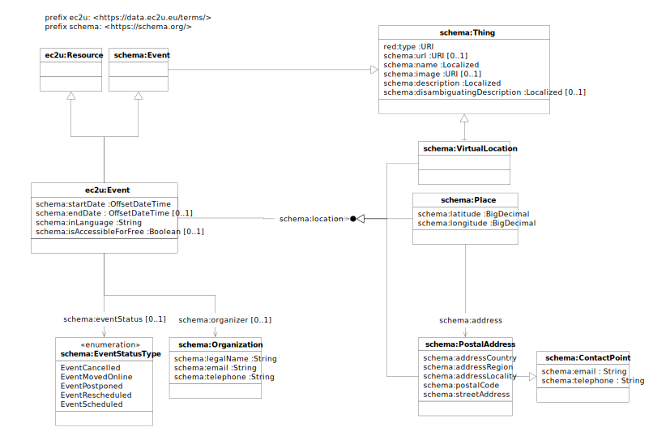

EC2U events are described using a controlled subset of the [schema:Event](https://schema.org/Event) data model, with the
following major deviations:

* property types and cardinality are tightly specified and constrained

* only events of interest to the academic population are included, so properties like `schema:typicalAgeRange` or
  `schema:audience` are not included.

# Minimal Model

The following properties are strongly suggested as a minimal description for events published from local sources:

| property                                 | schema.org property                | datatype         | notes                                                                                                                                                                                                                                                                              |
| ---------------------------------------- | ---------------------------------- | ---------------- |------------------------------------------------------------------------------------------------------------------------------------------------------------------------------------------------------------------------------------------------------------------------------------|
| the event title                          | `schema:name`                      | `Localized`      | if no language information is included, the system will assume the local language of the publishing university; missing translations in other alliance languages may be automatically provided by the system                                                                       |
| an exteneded event description           | `schema:description`               | `Localized`      | if no language information is included, the system will assume the local language of the publishing university; missing translations in other alliance languages may be automatically provided by the system                                                                       |
| a short event description                | `schema:disambiguatingDescription` | `Localized`      | if no language information is included, the system will assume the local language of the publishing university; missing translations in other alliance languages may be automatically provided by the system; if missing, may be automatically extracted from `schema:description` |
| a link to an image rrelated to the event | `schema:image`                     | `URI`            |                                                                                                                                                                                                                                                                                    |
| the event start date/time                | `schema:startDate`                 | `OffsetDateTime` | ISO 8601 offset format (`yyyy-MM-ddThh:mm:ss+hh:mm`) strongly suggested; other formats will be automatically converted assuming the local time zone of  the publishing university; missing time is normalized to `00:00:00`                                                        |
| the event end date/time                  | `schema:endDate`                   | `OffsetDateTime` | ISO 8601 offset format (`yyyy-MM-ddThh:mm:ss+hh:mm`) strongly suggested; other formats will be automatically converted assuming the local time zone of  the publishing university; missing time is normalized to `00:00:00`                                                        |
