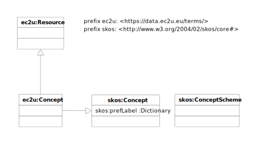

> ❗️Work in progress

The [EC2U Concepts Dataset](http://data.ec2u.eu/concepts/) defines topic taxonomies and other schemes available for
classifying [datasets](index.md) and [resources](rresources.md).

[Concept schemes](https://www.w3.org/TR/skos-primer/) provides tree-like subject definitions supporting interactive
resource searches and selective publishing use cases.

# Model

EC2U concepts are described using a controlled subset of the [SKOS](https://www.w3.org/TR/skos-reference/) data model.

## ec2u:ConceptScheme

> ❗️TBC

| property                                     | description          |
| -------------------------------------------- | -------------------- |
| all [ec2u:Resource](resources.md) properties | inherited properties |
| …                                            |                      |

## ec2u:Concept

> ❗️TBC

| property                                     | description          |
| -------------------------------------------- | -------------------- |
| all [ec2u:Resource](resources.md) properties | inherited properties |
| …                                            |                      |

# Licensing

> ❗️source-level license / copyright holder

> ❗️ Handle licensing for third-party embedded schemes

# Sources

> ❗️TBC

# Updating

> ❗️TBC