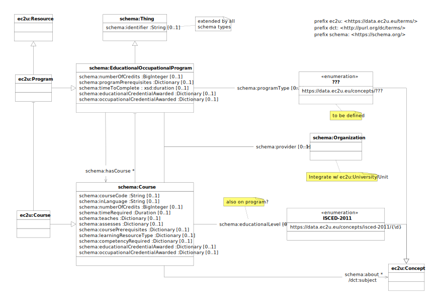

The [EC2U Courses Dataset](http://data.ec2u.eu/courses/) provides identifying and background information about
formal academic programs and courses offered at EC2U partner universities.

# Model

EC2U courses are described using a controlled subset of the [schema:EducationalOccupationalProgram](https://schema.org/EducationalOccupationalProgram) and  [schema:Course](https://schema.org/Course) data models.

## ec2u:Program

A program offered by an institution which determines the learning progress to achieve an outcome, usually a credential like a degree or certificate. This would define a discrete set of opportunities (e.g., courses) that together constitute a program.

| property                                                     | description                                                  |
| ------------------------------------------------------------ | ------------------------------------------------------------ |
| all [ec2u:Resource](resources.md) properties                 | inherited properties                                         |
| all [schema:Thing](things.md) properties                     | inherited properties                                         |
| [schema:provider](https://schema.org/provider)               | link to the provider                                         |
| [schema:identifier](https://schema.org/identifier)           | program identifier assigned by the course provider           |
| [schema:programType](https://schema.org/programType)         | link to a [TBD] program type in the `https://data.ec2u.eu/concepts/???/` [concept](concepts.md) scheme |
| [schema:hasCourse](https://schema.org/hasCourse)             | link to course that is one of the learning opportunities that are part of the program |
| [schema:numberOfCredits](https://schema.org/numberOfCredits) | number of [European Credit Transfer and Accumulation System (ECTS)](https://education.ec.europa.eu/education-levels/higher-education/inclusive-and-connected-higher-education/european-credit-transfer-and-accumulation-system) credits required to complete the program |
| [schema:programPrerequisites](https://schema.org/programPrerequisites) | human-readable, localized description of enrolment requirements |
| [schema:timeToComplete](https://schema.org/timeToComplete)   | the expected length of time to complete the program if attending full-time |
| [schema:educationalCredentialAwarded](https://schema.org/educationalCredentialAwarded) | human-readable, localized description of the qualification, award, certificate, diploma or other educational credential awarded as a consequence of successful completion |
| [schema:occupationalCredentialAwarded](https://schema.org/occupationalCredentialAwarded) | human-readable, localized description of the qualification, award, certificate, diploma or other occupational credential awarded as a consequence of successful completion |

## ec2u:Course

| property                                                     | description                                                  |
| ------------------------------------------------------------ | ------------------------------------------------------------ |
| all [ec2u:Resource](resources.md) properties                 | inherited properties                                         |
| all [schema:Thing](things.md) properties                     | inherited properties                                         |
| [schema:provider](https://schema.org/provider)               | link to the provider                                         |
| [schema:courseCode](https://schema.org/courseCode) /[schema:identifier](https://schema.org/identifier) | course identifier assigned by the course provider            |
| [schema:educationalLevel](https://schema.org/educationalLevel) | link to a 1-digit [ISCED 2011](http://uis.unesco.org/en/topic/international-standard-classification-education-isced) education level in the `https://data.ec2u.eu/concepts/isced-2011/` [concept](concepts.md) scheme |
| [schema:inLanguage](https://schema.org/inLanguage)           | 2-letters [IETF BCP 47](http://tools.ietf.org/html/bcp47) code of the teaching / evaluation language (e.g. `en` ) |
| [schema:numberOfCredits](https://schema.org/numberOfCredits) | number of [European Credit Transfer and Accumulation System (ECTS)](https://education.ec.europa.eu/education-levels/higher-education/inclusive-and-connected-higher-education/european-credit-transfer-and-accumulation-system) credits awarded |
| [schema:timeRequired](https://schema.org/timeRequired)       | scheduled workload in [ISO 8601 duration](https://www.w3.org/TR/xmlschema-2/#duration) format; hour‑based duration (e.g. `PT60H`) strongly suggested |
| [schema:about](https://schema.org/about)                     | link to a subject; must reference one the SKOS concepts managed by the *Knowledge Hub* (see also `dct:subject` [Resource](resources.md#model) property) |
| [schema:teaches](https://schema.org/teaches)                 | human-readable, localized description of target competency or learning contents |
| [schema:assesses](https://schema.org/assesses)               | human-readable, localized description of expected competency or learning outcome |
| [schema:coursePrerequisites](https://schema.org/coursePrerequisites) | human-readable, localized description of admission requirements |
| [schema:learningResourceType](https://schema.org/learningResourceType) | human-readable, localized description of teaching methods and mode of study |
| [schema:competencyRequired](https://schema.org/competencyRequired) | human-readable, localized description of knowledge, skill, ability or personal attribute that must be demonstrated in order to earn related educational or occupational credentials (see below) |
| [schema:educationalCredentialAwarded](https://schema.org/educationalCredentialAwarded) | human-readable, localized description of the qualification, award, certificate, diploma or other educational credential awarded as a consequence of successful completion |
| [schema:occupationalCredentialAwarded](https://schema.org/occupationalCredentialAwarded) | human-readable, localized description of the qualification, award, certificate, diploma or other occupational credential awarded as a consequence of successful completion |

# Licensing

> ❗️ To be confirmed.

[EC2U Courses Dataset](https://data.ec2u.eu/units/) © 2022 by [EC2U Alliance](https://www.ec2u.eu/) is licensed
under [Attribution-NonCommercial-NoDerivatives 4.0 International](http://creativecommons.org/licenses/by-nc-nd/4.0/?ref=chooser-v1)

# Sources

Research units are crawled from different local academic sources and mapped as far as possible to the shared data model:
source analysis and integration status are detailed in the linked source sheets.

| status | university                                                   |
| ------ | ------------------------------------------------------------ |
| ✓      | [Pavia](../../src/main/java/eu/ec2u/data/tasks/courses/CoursesPavia.md) |
| ✓      | [Coimbra](../../src/main/java/eu/ec2u/data/tasks/courses/CoursesCoimbra.md) |

# Updating

* Data sources are crawled nightly using custom data integration scripts that extract structured data from dedicated
  APIs, RSS feed, embedded HTML micro-annotations or embedded JSON/LD metadata; custom scraping from HTML content is
  currently not supported in order to improve the overall robustness of the process

