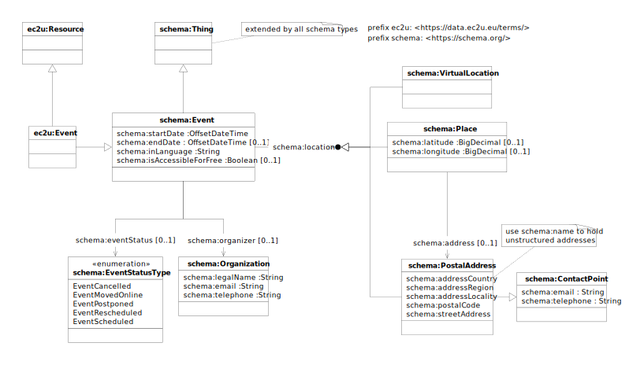

The [EC2U Events Dataset](http://data.ec2u.eu/events/) dynamically collects information about local events at partner
cities from local academic, public and commercial sources.

It is mainly intended to support event search on the [My Mobile Tutor](https://mmt.ec2u.eu) mobile app developed by WP2
of the EC2U project under the cordination of the University of Turku, but can be searched and integrated by third-party
tools as any other EC2U dataset.

# Model



EC2U events are described using a controlled subset of the [schema:Event](https://schema.org/Event) data model, with the
following major deviations:

* only events of interest to the academic population are included, so properties like `schema:typicalAgeRange` or
  `schema:audience` are not included.

## Minimal Model

The following properties are strongly suggested as a minimal description for events published from local sources:

| property                                     | description          | notes                                                        |
| -------------------------------------------- | -------------------- | ------------------------------------------------------------ |
| all [ec2u:Resource](resources.md) properties | inherited properties |                                                              |
| all [schema:Thing](things.md) properties     | inherited properties |                                                              |
| `schema:startDate`                           | start date/time      | ISO 8601 offset format (`yyyy-MM-ddThh:mm:ss+hh:mm`) strongly suggested; other formats will be automatically converted assuming the local time zone of  the publishing university; missing time is normalized to `00:00:00` |
| `schema:endDate`                             | end date/time        | ISO 8601 offset format (`yyyy-MM-ddThh:mm:ss+hh:mm`) strongly suggested; other formats will be automatically converted assuming the local time zone of  the publishing university; missing time is normalized to `00:00:00` |
| `schema:location`                            | location             | reference to a location described with a least a name        |

# Licensing

> ❗️source-level license / copyright holder

# Sources

Events are crawled from different local academic, public and commercial sources and mapped as far as possible to the
shared data model: source analysis and integration status are detailed in the linked source sheets.

| status | city      | coverage    | publisher                                                    |
| ------ | --------- | ----------- | ------------------------------------------------------------ |
| ✗      | Coimbra   | Association | [Academic Association of Coimbra (AAC) / Calendar of Events](../../src/main/java/eu/ec2u/data/tasks/events/EventsCoimbraAcademica.md) |
| ✓      | Coimbra   | City        | [Câmara Municipal de Coimbra / CoimbrAgenda](../../src/main/java/eu/ec2u/data/tasks/events/EventsCoimbraCity.md) |
| ✗      | Coimbra   | Other       | [Convento São Francisco / Agenda Cultural](../../src/main/java/eu/ec2u/data/tasks/events/EventsCoimbraSaoFrancisco.md) |
| ✓      | Coimbra   | University  | [University of Coimbra / Agenda UC](../../src/main/java/eu/ec2u/data/tasks/events/EventsCoimbraUniversity.md) |
| ✓      | Iasi      | City        | [Iaşul Cultural](../../src/main/java/eu/ec2u/data/tasks/events/EventsIasiCityCultura.md) |
| ✓      | Iasi      | City        | [InOras / Evenimente in Iași](../../src/main/java/eu/ec2u/data/tasks/events/EventsIasiCityInOras.md) |
| ✓      | Iasi      | University  | [University of Iasi / Events](../../src/main/java/eu/ec2u/data/tasks/events/EventsIasiUniversity.md) |
| ✓      | Iasi      | University  | [University of Iasi / 360 Events](../../src/main/java/eu/ec2u/data/tasks/events/EventsIasiUniversity360.md) |
| ✓      | Jena      | City        | [Stadt Jena / Veranstaltungskalender](../../src/main/java/eu/ec2u/data/tasks/events/EventsJenaCity.md) |
| ✓      | Jena      | University  | [Friedrich-Schiller-Universität Jena / Events](../../src/main/java/eu/ec2u/data/tasks/events/EventsJenaUniversity.md) |
| ✓      | Pavia     | City        | [Comune di Pavia / ViviPavia](../../src/main/java/eu/ec2u/data/tasks/events/EventsPaviaCity.md) |
| ✓      | Pavia     | College     | [Almo Collegio Borromeo / Calendario](../../src/main/java/eu/ec2u/data/tasks/events/EventsPaviaBorromeo.md) |
| ✗      | Pavia     | College     | [Fondazione Ghislieri / Calendario Eventi](../../src/main/java/eu/ec2u/data/tasks/events/EventsPaviaGhislieri.md) |
| ✓      | Pavia     | University  | [University of Pavia / News](../../src/main/java/eu/ec2u/data/tasks/events/EventsPaviaUniversity.md) |
| ✗      | Poitiers  | City        | [Ville de Poitiers / Evenements](../../src/main/java/eu/ec2u/data/tasks/events/EventsPoitiersCity.md) |
| ✓      | Poitiers  | City        | [Grand Poitiers / Sortir](../../src/main/java/eu/ec2u/data/tasks/events/EventsPoitiersCityGrand.md) |
| ✓      | Poitiers  | University  | [Université de Poitiers / Actualités et événements](../../src/main/java/eu/ec2u/data/tasks/events/EventsPoitiersUniversity.md) |
| ✗      | Salamanca | City        | [Fundación Salamanca Ciudad de Cultura y Saberes](../../src/main/java/eu/ec2u/data/tasks/events/EventsSalamancaCity.md) |
| ✓      | Salamanca | City        | [SACIS - Salamanca Sociedad Cooperativa de Iniciativa Social](../../src/main/java/eu/ec2u/data/tasks/events/EventsSalamancaCitySACIS.md) |
| ✓      | Salamanca | City        | [Oficina de Turismo de Salamanca](../../src/main/java/eu/ec2u/data/tasks/events/EventsSalamancaCityTO.md) |
| ✓      | Salamanca | University  | [Universidad de Salamanca / Servicio de Actividades Culturales](.././/src/main/java/eu/ec2u/data/tasks/events/EventsSalamancaUniversity.md) |
| ✗      | Turku     | City        | [Turun kaupunki / Tapahtumakalenteri](../../src/main/java/eu/ec2u/data/tasks/events/EventsTurkuCity.md) |
| ✓      | Turku     | Association | [The Student Union of the University of Turku (TYY) / Calendar of Events](../../src/main/java/eu/ec2u/data/tasks/events/EventsTurkuTYY.md) |
| ✓      | Turku     | University  | [University of Turku / News](../../src/main/java/eu/ec2u/data/tasks/events/EventsTurkuUniversity.md) |

# Updating

* Data sources are crawled nightly using custom data integration scripts that extract structured data from dedicated
  APIs, RSS feed, embedded HTML micro-annotations or embedded JSON/LD metadata; custom scraping from HTML content is
  currently not supported in order to improve the overall robustness of the process
* Stale events are removed nightly just before source crawling; events are considered stale if either:
  * the latest between `schema:starDate` and `schema:endDate` timestamp is in the past
  * no date info is provided and the event was crawled more than a month in the past

---

# QA Queries

## Stats

```http
GET https://data.ec2u.eu/events/?.stats
```

## Breakdowns

### By University

```http
GET https://data.ec2u.eu/events/?.terms=university
```

### By Publisher

```http
GET https://data.ec2u.eu/events/?.terms=publisher
```

## Filtering

Both query types may be filtered by adding the following parameters to the base URL.

### By Last Update

```http
GET https://data.ec2u.eu/events/?.stats&>modified=2022-06-01T00:00:00Z
```

### By End Date

```http
GET https://data.ec2u.eu/events/?.stats&>endDate=2022-06-01T00:00:00Z
```
