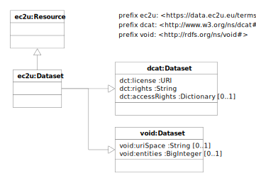

The [EC2U Dataset Catalog](https://data.ec2u.eu/) provides a searchable catalog of datasets made available on the *EC2U
Knowledge Hub*. Catalog entries include human and machine-readable dataset descriptions and basic information about
license and access rights for partners and other stakeholders.

External supporting datasets may also be listed in the catalog for reference and ease of access.

# Model

EC2U datasets are described using a controlled subset
of [Data Catalog Vocabulary (DCAT) - Version 2](https://www.w3.org/TR/vocab-dcat-2/)
and  [VoID](https://www.w3.org/TR/void/) data models.

## ec2u:Dataset

| property                                                     | description                                                  |
| ------------------------------------------------------------ | ------------------------------------------------------------ |
| all [ec2u:Resource](resources.md) properties                 | inherited properties                                         |
| [dct:license](https://www.w3.org/TR/vocab-dcat-2/#Property:resource_license) | the URL of the public text of the [licensing](../policies/licensing.md) terms for the catalog as a whole; entries in the dataset define their own licensing terms |
| [dct:rights](https://www.w3.org/TR/vocab-dcat-2/#Property:resource_rights) | the copyright statement (e.g. `Copyright © 2022 EC2U Alliance`) |
| [dct:accessRights](https://www.w3.org/TR/vocab-dcat-2/#Property:resource_access_rights) | a human-readable, localized description of access rights and policies for partners and other stakeholders |
| [void:uriSpace](https://www.w3.org/TR/void/#pattern)         | the common prefix of the IRIs of the principal entities in the dataset; if not specified, defaults to the IRI of the dataset (e.g. `https://data.ec2u.eu/events/`) |
| [void:entities](https://www.w3.org/TR/void/#statistics)      | the count of the principal entities in the dataset, that is of the datatset entities whos IRI starts with the prefix defined by the `void:uriSpace` property |

# Licensing

> ❗️ To be confirmed.

[EC2U Catalog Dataset ](https://data.ec2u.eu/)© 2022 by [EC2U Alliance](https://www.ec2u.eu/) is licensed
under [Attribution-NonCommercial-NoDerivatives 4.0 International](http://creativecommons.org/licenses/by-nc-nd/4.0/?ref=chooser-v1)

Individual datasets included in the catalog are licensed by their respective owners under the licensing terms specified
by the [`dct:rights`](https://www.w3.org/TR/vocab-dcat-2/#Property:resource_rights)
, [`dct:license`](https://www.w3.org/TR/vocab-dcat-2/#Property:resource_license)
and  [`dct:accessRights`](https://www.w3.org/TR/vocab-dcat-2/#Property:resource_access_rights) properties as described
above.

# Sources

* static content from application source code
* manually curated database content

# Updating

* static content is updated on demand by manually editing application source code
