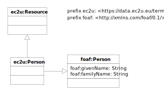

> ❗️Work in progress

The [EC2U Persons Dataset](http://data.ec2u.eu/persons/) provides identifying and background information about academic
and research staff at EC2U partner universities.

# Model

EC2U staff are described using a controlled subset of the [FOAF](http://xmlns.com/foaf/spec/) data model, extended with:

* the following [VIVO](https://wiki.lyrasis.org/display/VIVODOC113x/Ontology+Reference) `foaf:Person`
  subclasses for classification purposes:
  * `vivo:EmeritusFaculty`
    * `vivo:EmeritusProfessor`
  * `vivo:EmeritusLibrarian`
  * `vivo:EmeritusProfessor`
  * `vivo:FacultyMember`
  * `vivo:Librarian`
  * `vivo:NonAcademic`
  * `vivo:NonFacultyAcademic`
    * `vivo:Postdoc`
  * `vivo:Student`
    * `vivo:GraduateStudent`
    * `vivo:UndergraduateStudent`

## ec2u:Person

> ❗️TBC

| property                                     | description          |
| -------------------------------------------- | -------------------- |
| all [ec2u:Resource](resources.md) properties | inherited properties |
| foaf:title                                   |                      |
| foaf:givenName                               |                      |
| foaf:familyName                              |                      |

# Licensing

> ❗️ To be confirmed.

[EC2U Persons Dataset](https://data.ec2u.eu/persons/) © 2022-2023 by [EC2U Alliance](https://www.ec2u.eu/) is licensed
under [Attribution-NonCommercial-NoDerivatives 4.0 International](http://creativecommons.org/licenses/by-nc-nd/4.0/?ref=chooser-v1)