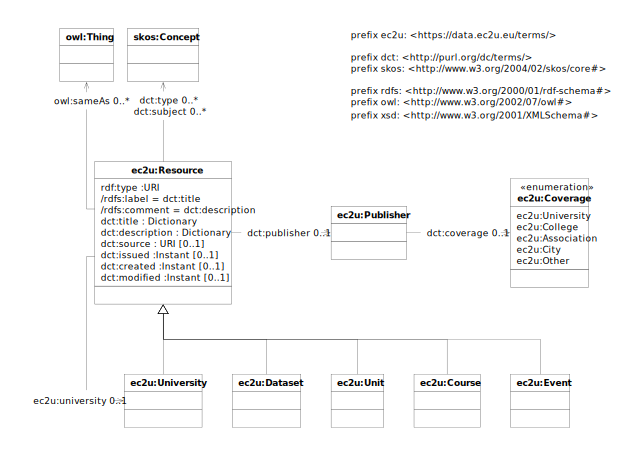

> - RDF data model
    >
- dataset RDF context
> - JSON-LD
    >
- RDF › JSON-LD

---

# Model

EC2U resources are described using a controlled subset of
the [Dublin Core](https://www.dublincore.org/specifications/dublin-core/dcmi-terms/) data model.

All generic human-readable labels and descriptions are localized either in English or in one of the local EC2U partner
languages.

## ec2u:Resource

| property        | description |
| --------------- | ----------- |
| dct:title       |             |
| dct:description |             |
| dct:publisher   |             |
| dct:source      |             |
| dct:issued      |             |
| dct:created     |             |
| dct:modified    |             |
| dct:subject     |             |
| ec2u:university |             |

> ❓Replace `ec2u:university` with `dct:coverage` ?

