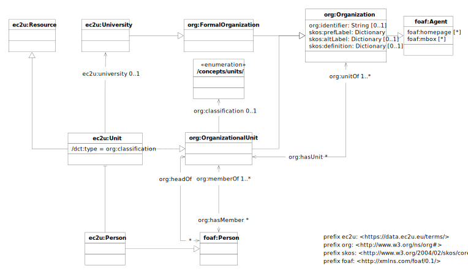

The [EC2U Research Units Dataset](http://data.ec2u.eu/units/) provides identifying and background information about
research and innovation units and supporting structures at EC2U partner universities.

# Model

EC2U research units and facilities are described using a controlled subset of
the [Organization Ontology](https://www.w3.org/TR/vocab-org/) data model, extended with:

* [SKOS](https://www.w3.org/TR/skos-primer/#seclabel) labels, as per *Organization Ontology* recommendations

## ec2u:Unit

| property                                                     | description                                                  |
| ------------------------------------------------------------ | ------------------------------------------------------------ |
| all [ec2u:Resource](resources.md) properties                 | inherited properties                                         |
| [org:identifier](https://www.w3.org/TR/vocab-org/#org:identifier) | unique machine-readable unit registration identifier         |
| [skos:prefLabel](https://www.w3.org/TR/skos-reference/#labels) | the human-readable, localized offical name of the unit       |
| [skos:altLabel](https://www.w3.org/TR/skos-reference/#labels) | human-readable, localized alternate/shortened names for the unit; may be used also for informal acronyms |
| [org:unitOf](https://www.w3.org/TR/vocab-org/#org:unitOf)    | a link to the owning partner [university](universities.md) or parent unit; parent links must reference a resource listed in the * |
| EC2U Research Units Dataset*                                 |                                                              |
| [org:hasUnit](https://www.w3.org/TR/vocab-org/#org:hasUnit)  | a link to a child unit; must reference a resource listed in the *EC2U Research Units Dataset* |
| [org:hasMember](https://www.w3.org/TR/vocab-org/#property-hasmember) | a link to an affilated member [staff](persons.md)            |

## ec2u:University

> ❗️ Move to [universities](universities.md)

| property                                                    | description                                                  |
| ----------------------------------------------------------- | ------------------------------------------------------------ |
| [org:hasUnit](https://www.w3.org/TR/vocab-org/#org:hasUnit) | a link to a child unit; must reference a resource listed in the [research units](units.md) dataset |

## ec2u:Person

❗️ Move to [persons](persons.md)

| property                                                     | description                                                  |
| ------------------------------------------------------------ | ------------------------------------------------------------ |
| [org:headOf](https://www.w3.org/TR/vocab-org/#property-headof) | a link to a [research unit](units.md) the person is leading  |
| [org:memberOf](https://www.w3.org/TR/vocab-org/#property-memberof) | a link to a [research unit](units.md) the person is affiliated with |

# Licensing

> ❗️ To be confirmed.

[EC2U Research Units Dataset](https://data.ec2u.eu/units/) © 2022 by [EC2U Alliance](https://www.ec2u.eu/) is licensed
under [Attribution-NonCommercial-NoDerivatives 4.0 International](http://creativecommons.org/licenses/by-nc-nd/4.0/?ref=chooser-v1)

# Sources

Research units are crawled from different local academic sources and mapped as far as possible to the shared data model:
source analysis and integration status are detailed in the linked source sheets.

| status      | university | feed |
| ----------- | ---------- | ---- |
| in progress | Pavia      |      |
| in progress | Salamanca  |      |
| in progress | Coimbra    |      |

# Updating

* Data sources are crawled nightly using custom data integration scripts that extract structured data from dedicated
  APIs, RSS feed, embedded HTML micro-annotations or embedded JSON/LD metadata; custom scraping from HTML content is
  currently not supported in order to improve the overall robustness of the process