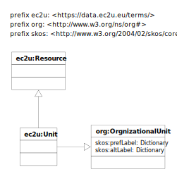

# Vocabularies

EC2U research units and facilities are described using a controlled subset of
the [Organization Ontology](https://www.w3.org/TR/vocab-org/) data model, extended with:

* [SKOS](https://www.w3.org/TR/skos-primer/#seclabel) labels, as per *Organization Ontology* recommendations
* the following [VIVO](https://wiki.lyrasis.org/display/VIVODOC113x/Ontology+Reference) foaf:Organization`
  subclasses for classification purposes:
  * `vivo:Association`
  * `vivo:Center`
  * `vivo:ClinicalOrganization`
  * `vivo:College`
  * `vivo:Company`
    * `vivo::PrivateCompany`
  * `vivo:Consortium`
  * `vivo:Department`
    * `vivo:AcademicDepartment`
  * `vivo:Division`
  * `vivo:ExtensionUnit`
  * `vivo:Foundation`
  * `vivo:FundingOrganization`
  * `vivo:GovernmentAgency`
  * `vivo:Hospital`
  * `vivo:Institute`
  * `vivo:Laboratory`
    * `vivo:ServiceProvidingLaboratory`
  * `vivo:Library`
  * `vivo:Museum`
  * `vivo:Program`
  * `vivo:Publisher`
  * `vivo:ResearchOrganization`
  * `vivo:School`
  * `vivo:StudentOrganization`
  * `vivo:University`