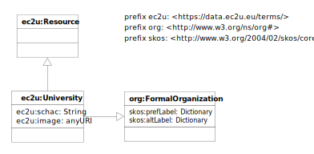

The [EC2U Universities Dataset](http://data.ec2u.eu/universities/) provides identifying and background information about
EC2U partner universities.

# Model

EC2U partner universities are described using a controlled subset of
the [Organization Ontology](https://www.w3.org/TR/vocab-org/) data model, extended with:

* [SKOS](https://www.w3.org/TR/skos-primer/#seclabel) labels, as per *Organization Ontology* recommendations
* some internal specialized properties

## ec2u:University

| property                                                     | definition                                                   |
| ------------------------------------------------------------ | ------------------------------------------------------------ |
| all [ec2u:Resource](resources.md) properties                 | inherited properties                                         |
| [skos:prefLabel](https://www.w3.org/TR/skos-reference/#labels) | the human-readable, localized offical name of the institution |
| [skos:altLabel](https://www.w3.org/TR/skos-reference/#labels) | human-readable, localized alternate/shortened names for the institution |
| ec2u:schac                                                   | the [SCHAC code](https://wiki.uni-foundation.eu/pages/viewpage.action?pageId=12746935) of the institution |
| ec2u:image                                                   | the URL of a generic outdoor image                           |

# Licensing

> ❗️ To be confirmed.

[EC2U Universities Dataset ](https://data.ec2u.eu/universities/)© 2022 by [EC2U Alliance](https://www.ec2u.eu/) is
licensed
under [Attribution-NonCommercial-NoDerivatives 4.0 International](http://creativecommons.org/licenses/by-nc-nd/4.0/?ref=chooser-v1)

# Sources

* static content from application source code
* background information extracted from [Wikidata](https://www.wikidata.org/)

# Updating

* base static content is updated on demand by manually editing application source code
* background information extracted from Wikidata is crawled nightly using custom data integration scripts that extract
  structured data from its public SPARQL endpoint
