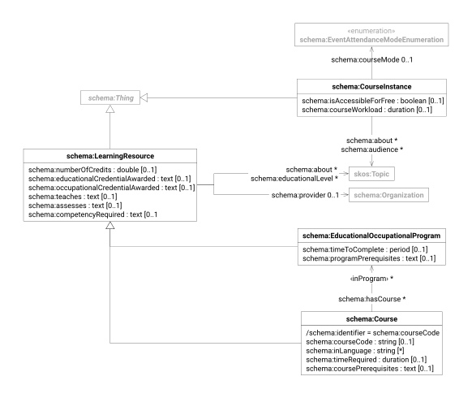

This document describes the [Schema.org](https://schema.org/docs/schemas.html) types and properties used for modeling
learning resources, including courses, programs, and educational offerings. These schemas enable structured
representation of educational content for search engines and educational applications.

| prefix  | namespace           | definition              |
|---------|---------------------|-------------------------|
| schema: | https://schema.org/ | [Schema.org] vocabulary |

# Learning Resource

| term                                                    | type                                                   | #    | description                                                           |
|---------------------------------------------------------|--------------------------------------------------------|------|-----------------------------------------------------------------------|
| **[schema:LearningResource][schema-learning-resource]** | [schema:Thing]                                         |      | A creative work that provides educational value                       |
| [schema:numberOfCredits]                                | decimal                                                | 0..1 | number of credits awarded for the learning resource                   |
| [schema:teaches]                                        | text                                                   | 0..1 | goals, structure and contents of the learning resource                |
| [schema:assesses]                                       | text                                                   | 0..1 | competences acquired through the learning resource                    |
| [schema:competencyRequired]                             | text                                                   | 0..1 | what must be demonstrated to complete the resource                    |
| [schema:educationalCredentialAwarded]                   | [schema:EducationalOccupationalCredential][credential] | 0..1 | links to the educational credential awarded by the learning resource  |
| [schema:occupationalCredentialAwarded]                  | [schema:EducationalOccupationalCredential][credential] | 0..1 | links to the occupational credential awarded by the learning resource |
| [schema:educationalLevel]                               | [skos:Concept]                                         | *    | links to the educational levels of the learning resource              |
| [schema:about]                                          | [skos:Concept]                                         | *    | links to topics covered by the learning resource                      |
| [schema:provider]                                       | [schema:Organization]                                  | 0..1 | links to the organization providing the learning resource             |

# Educational Occupational Program

| term                                        | type                                         | #    | description                                                                                      |
|---------------------------------------------|----------------------------------------------|------|--------------------------------------------------------------------------------------------------|
| **[schema:EducationalOccupationalProgram]** | [schema:LearningResource][learning-resource] |      | A program offered by an institution which determines the learning progress to achieve an outcome |
| [schema:timeToComplete]                     | duration                                     | 0..1 | expected time to complete the program                                                            |
| [schema:programPrerequisites]               | text                                         | 0..1 | what a candidate must satisfy to be admitted to the program                                      |
| [schema:hasCourse]                          | [schema:Course][course]                      | *    | links to courses that are part of the program                                                    |

# Course

| term                               | type                                         | #    | description                                                                       |
|------------------------------------|----------------------------------------------|------|-----------------------------------------------------------------------------------|
| **[schema:Course][schema-course]** | [schema:LearningResource][learning-resource] |      | A description of an educational course which may be offered as distinct instances |
| [schema:courseCode]                | string                                       | 0..1 | identifier of the course                                                          |
| [schema:inLanguage]                | string                                       | *    | language of the course                                                            |
| [schema:timeRequired]              | duration                                     | 0..1 | time required for the course                                                      |
| [schema:coursePrerequisites]       | text                                         | 0..1 | what a candidate must satisfy to be admitted to the course                        |

# Course Instance

| term                         | type                             | #    | description                                                                                                          |
|------------------------------|----------------------------------|------|----------------------------------------------------------------------------------------------------------------------|
| **[schema:CourseInstance]**  | [schema:Thing]                   |      | An instance of a Course which is distinct from other instances because it is offered at a different time or location |
| [schema:isAccessibleForFree] | boolean                          | 0..1 | whether the course instance is accessible for free                                                                   |
| [schema:courseMode]          | [EventAttendanceModeEnumeration] | 0..1 | attendance mode of the course instance                                                                               |
| [schema:courseWorkload]      | duration                         | 0..1 | workload of the course instance                                                                                      |
| [schema:instructor]          | [foaf:Person]                    | *    | links to the instructors of the course instance                                                                      |
| [schema:about]               | [skos:Concept]                   | *    | links to topics covered by the course instance                                                                       |
| [schema:audience]            | [skos:Concept]                   | *    | links to the intended audience of the course instance                                                                |

# Educational Occupational Credential

| term                                                              | type                 | # | description                                                                            |
|-------------------------------------------------------------------|----------------------|---|----------------------------------------------------------------------------------------|
| **[schema:EducationalOccupationalCredential][schema-credential]** | [schema:Thing]       |   | A credential awarded on completion of an educational or occupational course or program |
| [schema:credentialCategory]                                       | [CredentialCategory] | 1 | category of the credential                                                             |

# Credential Category

Category of the credential awarded by a learning resource.

| value         | description                                |
|---------------|--------------------------------------------|
| `Degree`      | an academic degree                         |
| `Certificate` | a certificate of attendance or achievement |
| `Badge`       | an Open Badge digital certification        |

[Schema.org]: https://schema.org/

[schema-learning-resource]: https://schema.org/LearningResource

[schema:Thing]: schema.md#thing

[schema:numberOfCredits]: https://schema.org/numberOfCredits

[schema:educationalCredentialAwarded]: https://schema.org/educationalCredentialAwarded

[schema:occupationalCredentialAwarded]: https://schema.org/occupationalCredentialAwarded

[schema:teaches]: https://schema.org/teaches

[schema:assesses]: https://schema.org/assesses

[schema:competencyRequired]: https://schema.org/competencyRequired

[schema:educationalLevel]: https://schema.org/educationalLevel

[skos:Concept]: skos.md#concept

[schema:about]: https://schema.org/about

[schema:provider]: https://schema.org/provider

[schema:Organization]: schema.md#organization

[schema:EducationalOccupationalProgram]: https://schema.org/EducationalOccupationalProgram

[learning-resource]: #learning-resource

[schema:timeToComplete]: https://schema.org/timeToComplete

[schema:programPrerequisites]: https://schema.org/programPrerequisites

[schema:hasCourse]: https://schema.org/hasCourse

[course]: #course

[schema-course]: https://schema.org/Course

[schema:courseCode]: https://schema.org/courseCode

[schema:inLanguage]: https://schema.org/inLanguage

[schema:timeRequired]: https://schema.org/timeRequired

[schema:coursePrerequisites]: https://schema.org/coursePrerequisites

[schema:CourseInstance]: https://schema.org/CourseInstance

[schema:isAccessibleForFree]: https://schema.org/isAccessibleForFree

[schema:courseMode]: https://schema.org/courseMode

[EventAttendanceModeEnumeration]: https://schema.org/EventAttendanceModeEnumeration

[schema:courseWorkload]: https://schema.org/courseWorkload

[schema:instructor]: https://schema.org/instructor

[foaf:Person]: foaf.md#person

[schema:audience]: https://schema.org/audience

[schema-credential]: https://schema.org/EducationalOccupationalCredential

[credential]: #educational-occupational-credential

[schema:credentialCategory]: https://schema.org/credentialCategory

[CredentialCategory]: #credential-category
