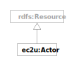

> **⚠️** **Work in progress…**

# Data Model

EC2U knowledge ecosystem actors are described using a [dedicated custom vocabulary](https://docs.google.com/spreadsheets/d/1CG0OjnmbGkxVWNF7xLAvzcic-KFCZIkujns_pMwphWU/edit?usp=sharing).

# Sources

Knowledge ecosystem actors are crawled from individual profiles submitted through a dedicated survey platform.

# Updating

* Data sources are crawled nightly using custom data integration scripts that extract structured data from survey result dumps.