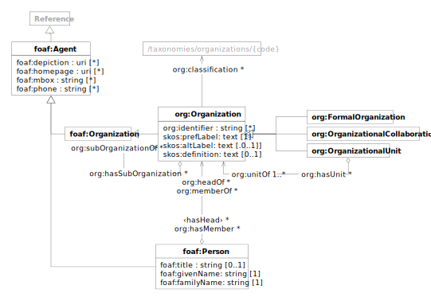

# Data Model

EC2U agents are described using a controlled subset
of
the [FOAF](http://xmlns.com/foaf/spec/) and [Organization Ontology](https://www.w3.org/TR/vocab-org/) data models,
extended with [SKOS](https://www.w3.org/TR/skos-primer/#seclabel) labels, as per *Organization Ontology* recommendations

| prefix | namespace                            | description                                                                          |
|--------|--------------------------------------|--------------------------------------------------------------------------------------|
| foaf:  | http://xmlns.com/foaf/0.1/           | [FOAF Vocabulary Specification 0.99](http://xmlns.com/foaf/spec/)                    |
| org:   | http://www.w3.org/ns/org#            | [The Organization Ontology](https://www.w3.org/TR/vocab-org/)                        |
| skos:  | http://www.w3.org/2004/02/skos/core# | [Simple Knowledge Organization System (SKOS)](https://www.w3.org/TR/skos-reference/) |

## Agent

| term                                                         | type                          | # | definition                                                         |
|--------------------------------------------------------------|-------------------------------|---|--------------------------------------------------------------------|
| [foaf:Agent](http://xmlns.com/foaf/spec/#term_Agent)         | [rdfs:Resource](resources.md) |   | An agent performing an activity, for instance a document publisher |
| [foaf:depiction](http://xmlns.com/foaf/spec/#term_depiction) | id                            | * | links to visual representations of the agent                       |
| [foaf:homepage](http://xmlns.com/foaf/spec/#term_homepage)   | id                            | * | links to public main web pages for the agent                       |
| [foaf:mbox](http://xmlns.com/foaf/spec/#term_mbox)           | string                        | * | contact email addresses for the agent                              |
| [foaf:phone](http://xmlns.com/foaf/spec/#term_phone)         | string                        | * | contact phone numbers for the agent                                |

> `❗️` According to the standard `foaf:mbox/phone` should be IRIs

## Organization

| term                                                                              | type                                           | #    | definition                                                                                                                                   |
|-----------------------------------------------------------------------------------|------------------------------------------------|------|----------------------------------------------------------------------------------------------------------------------------------------------|
| **[foaf:Organization](http://xmlns.com/foaf/spec/#term_Organization)**            | [foaf:Agent](#agent)                           |      |                                                                                                                                              |
| [**org:Organization**](https://www.w3.org/TR/vocab-org/#org:Organization)         | [foaf:Organization](#organization)             |      | organized agent                                                                                                                              |
| [skos:prefLabel](https://www.w3.org/TR/skos-reference/#labels)                    | text                                           | 1    | formal name of the organization                                                                                                              |
| [skos:altLabel](https://www.w3.org/TR/skos-reference/#labels)                     | text                                           | *    | informal/shortened/alternative names of the organization; may be used also for informal acronyms                                             |
| [skos:definition](https://www.w3.org/TR/skos-reference/#L1693)                    | text                                           | 0..1 |                                                                                                                                              |
| [org:identifier](https://www.w3.org/TR/vocab-org/#org:identifier)                 | typed                                          | *    | unique machine-readable organization identifier; as per specs, must refer to a typed literal whose datatype identifies the identifier scheme |
| [org:classification](https://www.w3.org/TR/vocab-org/#org:classification)         | [skos:Concept](concepts.md#concept)            | *    | links to organization types in the [/concepts/organizations](/concepts/organizations) taxonomy                                               |
| [org:subOrganizationOf](https://www.w3.org/TR/vocab-org/#org:subOrganizationOf)   | [org:Organization](#organization)              | *    | links to parent organizations                                                                                                                |
| [org:hasSubOrganization](https://www.w3.org/TR/vocab-org/#org:hasSubOrganization) | [org:Organization](#organization)              | *    | links to organizational units or affiliated organizations                                                                                    |
| [org:hasUnit](https://www.w3.org/TR/vocab-org/#org:hasUnit)                       | [org:OrganizationalUnit](#organizational-unit) | *    | links to organizational units                                                                                                                |
| [org:hasMember](https://www.w3.org/TR/vocab-org/#property-hasmember)              | [foaf:Person](#person)                         | *    | links to persons affiliated with the organization                                                                                            |
| ‹hasHead› = ^[org:headOf](https://www.w3.org/TR/vocab-org/#property-headof)       | [foaf:Person](#person)                         | *    | links to persons leading the organization                                                                                                    |

## Formal Organization

| term                                                                                    | type                              | # | definition                      |
|-----------------------------------------------------------------------------------------|-----------------------------------|---|---------------------------------|
| [**org:FormalOrganization**](https://www.w3.org/TR/vocab-org/#class-formalorganization) | [org:Organization](#organization) |   | legally recognized organization |

## Organizational Collaboration

| term                                                                                                      | type                              | # | definition                                               |
|-----------------------------------------------------------------------------------------------------------|-----------------------------------|---|----------------------------------------------------------|
| [**org:OrganizationalCollaboration**](https://www.w3.org/TR/vocab-org/#class-organizationalcollaboration) | [org:Organization](#organization) |   | informal collaboration structure involving organizations |

## Organizational Unit

| term                                                                                    | type                              | #    | definition                                 |
|-----------------------------------------------------------------------------------------|-----------------------------------|------|--------------------------------------------|
| [**org:OrganizationalUnit**](https://www.w3.org/TR/vocab-org/#class-organizationalunit) | [org:Organization](#organization) |      | working unit part of a larger organization |
| [org:unitOf](https://www.w3.org/TR/vocab-org/#org:unitOf)                               | [org:Organization](#organization) | 1..* | links to parent organizations              |

## Person

| term                                                               | type                              | #    | definition                                            |
|--------------------------------------------------------------------|-----------------------------------|------|-------------------------------------------------------|
| **[foaf:Person](http://xmlns.com/foaf/spec/#term_Person)**         | [foaf:Agent](#agent)              |      | legally recognized individual                         |
| [foaf:title](http://xmlns.com/foaf/spec/#term_title)               | string                            | 0..1 | personal professional title; for instance `Professor` |
| [foaf:givenName](http://xmlns.com/foaf/spec/#term_givenName)       | string                            | 1    | given name of the person                              |
| [foaf:familyName](http://xmlns.com/foaf/spec/#term_familyName)     | string                            | 1    | family name of the person                             |
| [org:memberOf](https://www.w3.org/TR/vocab-org/#property-memberof) | [org:Organization](#organization) | *    | links to organizations the person is affiliated with  |
| [org:headOf](https://www.w3.org/TR/vocab-org/#property-headof)     | [org:Organization](#organization) | *    | links to organizations the person is leading          |

> `❗️` Link titles to a taxonomy?
