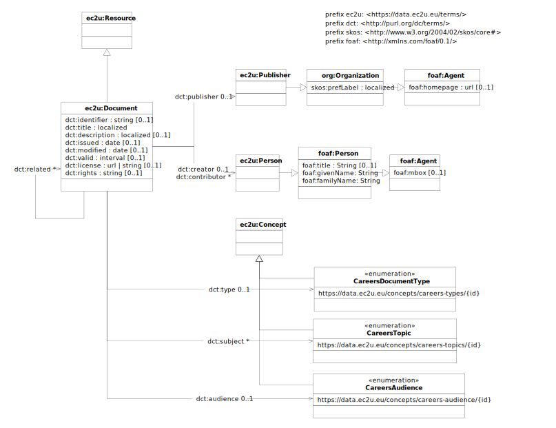

# Data Model

EC2U research careers documents are described using a controlled subset of
the [Dublin Core](https://www.dublincore.org/specifications/dublin-core/dcmi-terms/)
and [Organization Ontology](https://www.w3.org/TR/vocab-org/) data models, extended with:

* [SKOS](https://www.w3.org/TR/skos-primer/#seclabel) labels, as per *Organization Ontology* recommendations
* [foaf:Person](http://xmlns.com/foaf/0.1/#term_Person) and [foaf:Agent](http://xmlns.com/foaf/0.1/#term_Agent)
  properties

## ec2u:Document

| property                                            | description          |
| --------------------------------------------------- | -------------------- |
| all [ec2u:Resource](/datasets/resources) properties | inherited properties |
|                                                     |                      |

## ec2u:Publisher

| property                                                     | description                                             |
| ------------------------------------------------------------ | ------------------------------------------------------- |
| all [ec2u:Resource](/datasets/resources) properties          | inherited properties                                    |
| [skos:prefLabel](https://www.w3.org/TR/skos-reference/#labels) | the human-readable, localized official name of the unit |
| [foaf:homepage](http://xmlns.com/foaf/0.1/#term_homepage)    | the URL of an institutional home page                   |

## ec2u:Person

| property                                            | description                    |
| --------------------------------------------------- | ------------------------------ |
| all [ec2u:Resource](/datasets/resources) properties | inherited properties           |
| foaf:title                                          |                                |
| foaf:givenName                                      |                                |
| foaf:familyName                                     |                                |
| [foaf:mbox](http://xmlns.com/foaf/0.1/#term_mbox)   | an institutional email address |

