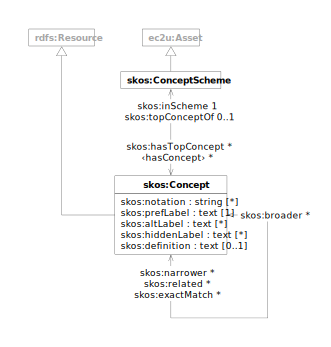

> ❗️Work in progress

[Concept schemes](https://www.w3.org/TR/skos-primer/) provides tree-like subject definitions supporting interactive
resource searches and selective publishing use cases.

# Data Model

EC2U concepts are described using a controlled subset of the [SKOS](https://www.w3.org/TR/skos-reference/) data model.

## ec2u:ConceptScheme

> ❗️TBC

| property                                     | description          |
| -------------------------------------------- | -------------------- |
| all [ec2u:Resource](/datasets/resources) properties | inherited properties |
| …                                            |                      |

## ec2u:Concept

> ❗️TBC

| property                                     | description          |
| -------------------------------------------- | -------------------- |
| all [ec2u:Resource](/datasets/resources) properties | inherited properties |
| …                                            |                      |

# Licensing

> ❗️source-level license / copyright holder

> ❗️ Handle licensing for third-party embedded schemes
