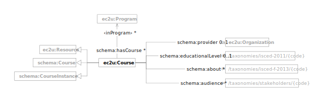

EC2U courses are described using a controlled subset of
the [Schema.org](../handbooks/vocabularies/schema-resource.md) data model.

| prefix  | namespace                   | description                                  |
|---------|-----------------------------|----------------------------------------------|
| ec2u:   | https://data.ec2u.eu/terms/ | EC2U Knowledge Hub vocabulary                |
| schema: | https://schema.org/         | [Schema.org](https://schema.org/) vocabulary |

# Course

| term                                                            | type                                                                                                                                                                                              | #    | description                                                                                        |
|-----------------------------------------------------------------|---------------------------------------------------------------------------------------------------------------------------------------------------------------------------------------------------|------|----------------------------------------------------------------------------------------------------|
| **ec2u:Course**                                                 | [ec2u:Resource](./index.md#resource), [schema:Course](../handbooks/vocabularies/schema-resource.md#course), [schema:CourseInstance](../handbooks/vocabularies/schema-resource.md#course-instance) |      | EC2U Knowledge Hub course                                                                          |
| [schema:provider](https://schema.org/provider)                  | [ec2u:Organization](organizations.md#organization)                                                                                                                                                | 1    | link to the organization providing the course                                                      |
| [schema:educationalLevel](https://schema.org/educationalLevel)  | [ec2u:Topic](taxonomies.md#topic)                                                                                                                                                                 | 0..1 | link to the educational level in the [ISCED 2011](/taxonomies/isced-2011/) taxonomy                |
| [schema:about](https://schema.org/about)                        | [ec2u:Topic](taxonomies.md#topic)                                                                                                                                                                 | *    | links to educational and training fields in the [ISCED-F 2013](/taxonomies/isced-f-2013/) taxonomy |
| [schema:audience](https://schema.org/audience)                  | [ec2u:Topic](taxonomies.md#topic)                                                                                                                                                                 | *    | links to intended audience groups in the [EC2U Stakeholders](/taxonomies/stakeholders/) taxonomy   |
| ‹inProgram› = ^[schema:hasCourse](https://schema.org/hasCourse) | [ec2u:Program](programs.md#program)                                                                                                                                                               | *    | links to programs including the course                                                             |
