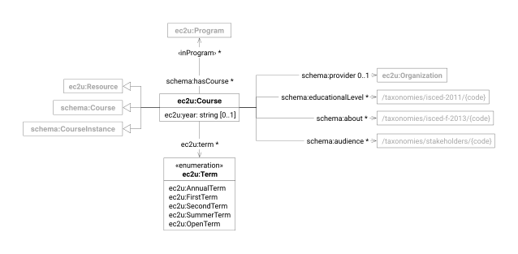

EC2U courses are described using a controlled subset of the [Schema.org](../about/vocabularies/schema-resource.md) data
model.

| prefix  | namespace                   | description                   |
|---------|-----------------------------|-------------------------------|
| ec2u:   | https://data.ec2u.eu/terms/ | EC2U Knowledge Hub vocabulary |
| schema: | https://schema.org/         | [Schema.org] vocabulary       |

# Course

| term                              | type                                                      | #    | description                                                             |
|-----------------------------------|-----------------------------------------------------------|------|-------------------------------------------------------------------------|
| **ec2u:Course**                   | [ec2u:Resource], [schema:Course], [schema:CourseInstance] |      | EC2U Knowledge Hub course                                               |
| [schema:provider]                 | [ec2u:Organization]                                       | 1    | link to the organization providing the course                           |
| [schema:educationalLevel]         | [ec2u:Topic]                                              | 0..1 | link to the educational level in the [ISCED 2011] taxonomy              |
| [schema:about]                    | [ec2u:Topic]                                              | *    | links to educational and training fields in the [ISCED-F 2013] taxonomy |
| [schema:audience]                 | [ec2u:Topic]                                              | *    | links to intended audience groups in the [EC2U Stakeholders] taxonomy   |
| ‹inProgram› = ^[schema:hasCourse] | [ec2u:Program]                                            | *    | links to programs including the course                                  |

[ec2u:Resource]: ./index.md#resource

[schema:Course]: ../about/vocabularies/schema-resource.md#course

[schema:CourseInstance]: ../about/vocabularies/schema-resource.md#course-instance

[schema:provider]: https://schema.org/provider

[schema:educationalLevel]: https://schema.org/educationalLevel

[schema:about]: https://schema.org/about

[schema:audience]: https://schema.org/audience

[schema:hasCourse]: https://schema.org/hasCourse

[ec2u:Organization]: organizations.md#organization

[ec2u:Program]: programs.md#program

[ec2u:Topic]: taxonomies.md#topic

[ISCED 2011]: /taxonomies/isced-2011/

[ISCED-F 2013]: /taxonomies/isced-f-2013/

[EC2U Stakeholders]: /taxonomies/stakeholders/

[Schema.org]: https://schema.org/
