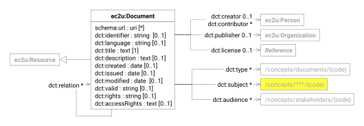

EC2U documents are described using a controlled subset of
the [Dublin Core](https://www.dublincore.org/specifications/dublin-core/dcmi-terms/)
data model, extended with some [schema.org](https://schema.org/) properties.

| prefix  | namespace                   | definition                                                                                                                |
|---------|-----------------------------|---------------------------------------------------------------------------------------------------------------------------|
| ec2u:   | https://data.ec2u.eu/terms/ | EC2U Knowledge Hub vocabulary                                                                                             |
| dct:    | http://purl.org/dc/terms/   | [Dublin Core] [DCMI Terms] |
| schema: | https://schema.org/         | [Schema.org] vocabulary                                                                              |

# Document

| term                                                                                                                        | type                                               | #    | description                                                                                                                                            |
|-----------------------------------------------------------------------------------------------------------------------------|----------------------------------------------------|------|--------------------------------------------------------------------------------------------------------------------------------------------------------|
| **ec2u:Document**                                                                                                           | [ec2u:Resource]               |      | EC2U governance document                                                                                                                               |
| [schema:url]                                                                                        | uri                                                | *    | URLs for accessing possibly localized online versions of the document                                                                                  |
| [dct:identifier]                        | string                                             | 0..1 | a formal document identifier assigned by the publisher                                                                                                 |
| [dct:language]                            | string                                             | 0..1 | the language of the document as an [RFC 5646] language tag (e.g. `en`)                                        |
| [dct:title]                                  | text                                               | 1    | the official title of the document                                                                                                                     |
| [dct:description]                      | text                                               | 0..1 | a summary of the document                                                                                                                              |
| [dct:creator]                              | [ec2u:Person]                   | 0..1 | link to the main document author / editor / contact                                                                                                    |
| [dct:contributor]                      | [ec2u:Person]                   | *    | links to the other document authors / contributors                                                                                                     |
| [dct:publisher]                          | [ec2u:Organization] | 0..1 | link to the organization responsible for the document                                                                                                  |
| [dct:created]                              | date                                               | 0..1 | the document creation date                                                                                                                             |
| [dct:issued]                                | date {≥ dct:created}                               | 0..1 | the formal issuance date of the document                                                                                                               |
| [dct:modified]                            | date {≥ dct:created}                               | 0..1 | the latest modification date of the document                                                                                                           |
| [dct:valid]                                  | string                                             | 0..1 | the document validity period, in ISO 8601 format (e.g.`yyyy` for yearly validity, e.g. 2022, or `yyyy/yyyy` for multi-year validity, e.g. `2022/2025`) |
| [dct:rights]                                | string                                             | 0..1 | the formal document copyright statement (e.g. `2023 © University of Pavia. All Rights Reserved`)                                                       |
| [dct:accessRights] | text                                               | 0..1 | the document access terms, as a human-readable localised legal statement                                                                               |
| [dct:license]                              | [*Reference*]                | 0..1 | link to the formal document licensing terms, as a link to a legal document available online                                                            |
| [dct:type]                                    | [ec2u:Topic]                  | *    | links to document types in the [EC2U Document Types] taxonomy                                                                  |
| [dct:subject]                              | [ec2u:Topic]                  | *    | {TBD}                                                                                                                                                  |
| [dct:audience]                            | [ec2u:Topic]                  | *    | links to intended audience groups in the [EC2U Stakeholders] taxonomy                                                       |
| [dct:relation]                            | [ec2u:Document]                         | *    | links to related documents                                                                                                                             |

[Dublin Core]: https://www.dublincore.org

[DCMI Terms]: https://www.dublincore.org/specifications/dublin-core/dcmi-terms/

[Schema.org]: https://schema.org/

[ec2u:Resource]: ./index.md#resource

[schema:url]: https://schema.org/url

[dct:identifier]: https://www.dublincore.org/specifications/dublin-core/dcmi-terms/terms/identifier/

[dct:language]: https://www.dublincore.org/specifications/dublin-core/dcmi-terms/terms/language/

[RFC 5646]: https://www.rfc-editor.org/info/rfc5646

[dct:title]: https://www.dublincore.org/specifications/dublin-core/dcmi-terms/terms/title/

[dct:description]: https://www.dublincore.org/specifications/dublin-core/dcmi-terms/terms/description/

[dct:creator]: https://www.dublincore.org/specifications/dublin-core/dcmi-terms/terms/creator/

[ec2u:Person]: persons.md#person

[dct:contributor]: https://www.dublincore.org/specifications/dublin-core/dcmi-terms/terms/contributor/

[dct:publisher]: https://www.dublincore.org/specifications/dublin-core/dcmi-terms/terms/publisher/

[ec2u:Organization]: organizations.md#organization

[dct:created]: https://www.dublincore.org/specifications/dublin-core/dcmi-terms/terms/created/

[dct:issued]: https://www.dublincore.org/specifications/dublin-core/dcmi-terms/terms/issued/

[dct:modified]: https://www.dublincore.org/specifications/dublin-core/dcmi-terms/terms/modified/

[dct:valid]: https://www.dublincore.org/specifications/dublin-core/dcmi-terms/terms/valid/

[dct:rights]: https://www.dublincore.org/specifications/dublin-core/dcmi-terms/terms/rights/

[dct:accessRights]: https://www.dublincore.org/specifications/dublin-core/dcmi-terms/#http://purl.org/dc/terms/accessRights

[dct:license]: https://www.dublincore.org/specifications/dublin-core/dcmi-terms/terms/license/

[*Reference*]: ./index.md#reference

[dct:type]: https://www.dublincore.org/specifications/dublin-core/dcmi-terms/terms/type/

[ec2u:Topic]: taxonomies.md#topic

[EC2U Document Types]: /taxonomies/documents/

[dct:subject]: https://www.dublincore.org/specifications/dublin-core/dcmi-terms/terms/subject/

[dct:audience]: https://www.dublincore.org/specifications/dublin-core/dcmi-terms/terms/audience/

[EC2U Stakeholders]: /taxonomies/stakeholders/

[dct:relation]: https://www.dublincore.org/specifications/dublin-core/dcmi-terms/terms/relation/

[ec2u:Document]: #document
