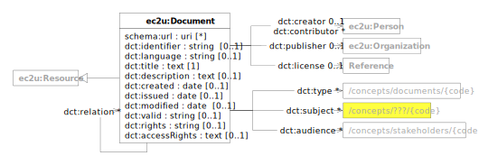

# Data Model

EC2U official documents are described using a controlled subset of
the [Dublin Core](https://www.dublincore.org/specifications/dublin-core/dcmi-terms/)
data model, extended with some [schema.org](https://schema.org/) properties.

| prefix  | namespace                   | definition                                                                                                                |
|---------|-----------------------------|---------------------------------------------------------------------------------------------------------------------------|
| ec2u:   | https://data.ec2u.eu/terms/ | EC2U Knowledge Hub vocabulary                                                                                             |
| dct:    | http://purl.org/dc/terms/   | [Dublin Core](https://www.dublincore.org) [DCMI Terms](https://www.dublincore.org/specifications/dublin-core/dcmi-terms/) |
| schema: | https://schema.org/         | [Schema.org](https://schema.org/) vocabulary                                                                              |

## Document

| term                                                                                                                        | type                                       | #    | description                                                                                                                                             |
|-----------------------------------------------------------------------------------------------------------------------------|--------------------------------------------|------|---------------------------------------------------------------------------------------------------------------------------------------------------------|
| **ec2u:Document**                                                                                                           | [rdfs:Resource](resources.md)              |      | EC2U official document                                                                                                                                  |
| [schema:url](https://schema.org/url)                                                                                        | id                                         | *    | URLs for accessing possibly localized online versions of the document                                                                                   |
| [dct:identifier](https://www.dublincore.org/specifications/dublin-core/dcmi-terms/terms/identifier/)                        | string                                     | 0..1 | a formal document identifier assigned by the publisher                                                                                                  |
| [dct:language](https://www.dublincore.org/specifications/dublin-core/dcmi-terms/terms/language/)                            | string                                     | 0..1 | the language of the document as an [RFC 5646](https://www.rfc-editor.org/info/rfc5646) language tag (e.g. `en`)                                         |
| [dct:title](https://www.dublincore.org/specifications/dublin-core/dcmi-terms/terms/title/)                                  | text                                       | 1    | the official title of the document                                                                                                                      |
| [dct:description](https://www.dublincore.org/specifications/dublin-core/dcmi-terms/terms/description/)                      | text                                       | 0..1 | a summary of the document                                                                                                                               |
| [dct:creator](https://www.dublincore.org/specifications/dublin-core/dcmi-terms/terms/creator/)                              | [foaf:Person](agents.md#person)            | 0..1 | a reference to the main document author / editor / contact                                                                                              |
| [dct:contributor](https://www.dublincore.org/specifications/dublin-core/dcmi-terms/terms/contributor/)                      | [foaf:Person](agents.md#person)            | *    | references to the other document authors / contributors                                                                                                 |
| [dct:publisher](https://www.dublincore.org/specifications/dublin-core/dcmi-terms/terms/publisher/)                          | [org:Organization](agents.md#organization) | 0..1 | a reference to the organization responsible for the document                                                                                            |
| [dct:created](https://www.dublincore.org/specifications/dublin-core/dcmi-terms/terms/created/)                              | date                                       | 0..1 | the document creation date                                                                                                                              |
| [dct:issued](https://www.dublincore.org/specifications/dublin-core/dcmi-terms/terms/issued/)                                | date {≥ dct:created}                       | 0..1 | the formal issuance date of the document                                                                                                                |
| [dct:modified](https://www.dublincore.org/specifications/dublin-core/dcmi-terms/terms/modified/)                            | date {≥ dct:created}                       | 0..1 | the latest modification date of the document                                                                                                            |
| [dct:valid](https://www.dublincore.org/specifications/dublin-core/dcmi-terms/terms/valid/)                                  | string                                     | 0..1 | the document validity period, in ISO 8601 format (e.g.`yyyy` for yearly validity, e.g. 2022, or `yyyy/yyyy` for multi-year validity, e.g. `2022/2025`)  |
| [dct:rights](https://www.dublincore.org/specifications/dublin-core/dcmi-terms/terms/rights/)                                | string                                     | 0..1 | the formal document copyright statement (e.g. `2023 © University of Pavia. All Rights Reserved`)                                                        |
| [dct:accessRights](https://www.dublincore.org/specifications/dublin-core/dcmi-terms/#http://purl.org/dc/terms/accessRights) | text                                       | 0..1 | the document access terms, as a human-readable localised legal statement                                                                                |
| [dct:license](https://www.dublincore.org/specifications/dublin-core/dcmi-terms/terms/license/)                              | [rdfs:Resource](resources.md)              | 0..1 | the formal document licensing terms, as a link to a legal document available online                                                                     |
| [dct:type](https://www.dublincore.org/specifications/dublin-core/dcmi-terms/terms/type/)                                    | [skos:Concept](concepts.md#concept)        | *    | the document type; must reference one the SKOS concepts defined by the [Document Types](/concepts/document-types/) taxonomy on the *Knowledge Hub*      |
| [dct:subject](https://www.dublincore.org/specifications/dublin-core/dcmi-terms/terms/subject/)                              | [skos:Concept](concepts.md#concept)        | *    | the document subjects; must reference SKOS concepts defined by the [Document Topics](/concepts/document-topics/) taxonomy on the *Knowledge Hub*        |
| [dct:audience](https://www.dublincore.org/specifications/dublin-core/dcmi-terms/terms/audience/)                            | [skos:Concept](concepts.md#concept)        | *    | the document audiences; must reference SKOS concepts defined by the [Document Audiences](/concepts/document-audiences/) taxonomy on the *Knowledge Hub* |
| [dct:relation](https://www.dublincore.org/specifications/dublin-core/dcmi-terms/terms/relation/)                            | [ec2u:Document](#document)                 | *    | references to related documents                                                                                                                         |
