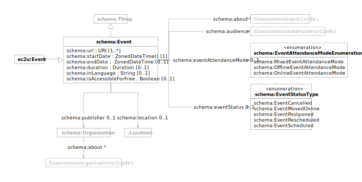

This dataset is mainly intended to support event search on the [My Mobile Tutor](https://mmt.ec2u.eu) mobile app developed by WP2 of the EC2U project under the coordination of the University of Turku, but can be searched and integrated by third-party tools as any other EC2U dataset.

# Data Model

EC2U events are described using a controlled subset of the [schema:Event](https://schema.org/Event) data model.

| prefix  | namespace           | definition                                   |
|---------|---------------------|----------------------------------------------|
| schema: | https://schema.org/ | [Schema.org](https://schema.org/) vocabulary |

## Minimal Model

| property                                                             | type                                                                                       | #    | description                                                                                               |
|----------------------------------------------------------------------|--------------------------------------------------------------------------------------------|------|-----------------------------------------------------------------------------------------------------------|
| **[schema:Event](https://schema.org/Event)**                         | [schema:Thing](things.md#thing)                                                            |      | academic or public local event                                                                            |
| [schema:url](https://schema.org/url)                                 | id                                                                                         | 1..* | links to public web pages describing the event                                                            |
| [schema:startDate](https://schema.org/startDate)                     | dateTime                                                                                   | 0..1 | start date and time of the event                                                                          |
| [schema:endDate](https://schema.org/endDate)                         | dateTime                                                                                   | 0..1 | end date and time of the event                                                                            |
| [schema:duration](https://schema.org/duration)                       | duration                                                                                   | 0..1 | event duration                                                                                            |
| [schema:inLanguage](https://schema.org/inLanguage)                   | string                                                                                     | 0..1 | 2-letters [IETF BCP 47](http://tools.ietf.org/html/bcp47) code of the main event language (e.g. `en` )    |
| [schema:isAccessibleForFree](https://schema.org/isAccessibleForFree) | boolean                                                                                    | 0..1 | flag signalling whether the event is accessible for free                                                  |
| [schema:eventAttendanceMode](https://schema.org/eventAttendanceMode) | [schema:EventAttendanceModeEnumeration](https://schema.org/EventAttendanceModeEnumeration) | 0..1 | event attendance mode                                                                                     |
| [schema:eventStatus](https://schema.org/eventStatus)                 | [schema:EventStatusType](https://schema.org/EventStatusType)                               | 0..1 | event status                                                                                              |
| [schema:publisher](https://schema.org/publisher)                     | [schema:Organization](things.md#organization)                                              | 0..1 | link to the organisation publishing                                                                       |
| [schema:organizer](https://schema.org/organizer)                     | [schema:Organization](things.md#organization)                                              | *    | link to the organisations organising the event                                                            |
| [schema:location](https://schema.org/location)                       | [Location](things.md#location)                                                             | *    | link to the event locations                                                                               |
| [schema:about](https://schema.org/about)                             | [skos:Concept](concepts.md#concept)                                                        | *    | event topics as links to entries in the [EC2U Event Topics](/concepts/event-topics) taxonomy              |
| [schema:audience](https://schema.org/audience)                       | [skos:Concept](concepts.md#concept)                                                        | *    | target event audiences as links to entries in the [EC2U Event Audiences](/concepts/event-topics) taxonomy |

# Licensing

> ❗️source-level license / copyright holder

# Updating

* Data sources are crawled nightly using custom data integration scripts that extract structured data from dedicated
  APIs, RSS feed, embedded HTML micro-annotations or embedded JSON/LD metadata; custom scraping from HTML content is
  currently not supported in order to improve the overall robustness of the process
* Stale events are removed nightly just before source crawling; events are considered stale if either:
  * the latest between `schema:starDate` and `schema:endDate` timestamp is in the past
  * no date info is provided and the event was crawled more than a month in the past
