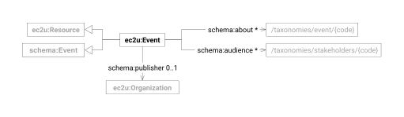

This dataset is mainly intended to support event search on the [My Mobile Tutor](https://mmt.ec2u.eu) mobile app developed by WP2 of the EC2U project under the coordination of the University of Turku, but can be searched and integrated by third-party tools as any other EC2U dataset.

EC2U events are described using a controlled subset of [Schema.org](../about/vocabularies/schema-event.md) data
model.

| prefix  | namespace                   | definition                            |
|---------|-----------------------------|---------------------------------------|
| ec2u:   | https://data.ec2u.eu/terms/ | EC2U Knowledge Hub vocabulary         |
| schema: | https://schema.org/         | [Schema.org] vocabulary   |

# Event

| term                | type                            | # | description                                                                                      |
|---------------------|---------------------------------|---|--------------------------------------------------------------------------------------------------|
| **ec2u:Event**      | [ec2u:Resource], [schema:Event] |   | EC2U event                                                                                       |
| [schema:publisher]  | [ec2u:Organization]             | 1 | link to the organization publishing the event                                                    |
| [schema:about]      | [ec2u:Topic]                    | * | links to event topics in the [EC2U Event Topics] taxonomy                                         |
| [schema:audience]   | [ec2u:Topic]                    | * | links to intended audience groups in the [EC2U Stakeholders] taxonomy                             |

[Schema.org]: https://schema.org/
[ec2u:Resource]: ./index.md#resource
[schema:Event]: ../about/vocabularies/schema-event.md
[schema:publisher]: https://schema.org/publisher
[ec2u:Organization]: organizations.md#organization
[schema:about]: https://schema.org/about
[ec2u:Topic]: taxonomies.md#topic
[EC2U Event Topics]: /taxonomies/events/
[schema:audience]: https://schema.org/audience
[EC2U Stakeholders]: /taxonomies/stakeholders/
