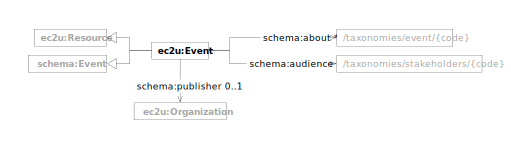

This dataset is mainly intended to support event search on the [My Mobile Tutor](https://mmt.ec2u.eu) mobile app developed by WP2 of the EC2U project under the coordination of the University of Turku, but can be searched and integrated by third-party tools as any other EC2U dataset.

EC2U events are described using a controlled subset of [Schema.org](../handbooks/vocabularies/schema-event.md) data
model.

| prefix  | namespace                   | definition                                   |
|---------|-----------------------------|----------------------------------------------|
| ec2u:   | https://data.ec2u.eu/terms/ | EC2U Knowledge Hub vocabulary                |
| schema: | https://schema.org/         | [Schema.org](https://schema.org/) vocabulary |

# Event

| term                                             | type                                                                                            | # | description                                                                                      |
|--------------------------------------------------|-------------------------------------------------------------------------------------------------|---|--------------------------------------------------------------------------------------------------|
| **ec2u:Event**                                   | [ec2u:Resource](./index.md#resource), [schema:Event](../handbooks/vocabularies/schema-event.md) |   | EC2U event                                                                                       |
| [schema:publisher](https://schema.org/publisher) | [ec2u:Organization](organizations.md#organization)                                              | 1 | link to the organization publishing the event                                                    |
| [schema:about](https://schema.org/about)         | [ec2u:Topic](taxonomies.md#topic)                                                               | * | links to event topics in the [EC2U Event Topics](/taxonomies/events/) taxonomy                   |
| [schema:audience](https://schema.org/audience)   | [ec2u:Topic](taxonomies.md#topic)                                                               | * | links to intended audience groups in the [EC2U Stakeholders](/taxonomies/stakeholders/) taxonomy |
