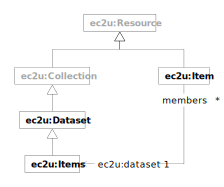

> **⚠️** **Work in progress…**

Catalog entries include human and machine-readable dataset descriptions and basic information about
license and access rights for partners and other stakeholders.

External supporting datasets may also be listed in the catalog for reference and ease of access.

# Data Model

EC2U datasets are described using a controlled subset
of [Data Catalog Vocabulary (DCAT) - Version 2](https://www.w3.org/TR/vocab-dcat-2/)
and  [VoID](https://www.w3.org/TR/void/) data models, as outlined by
the [Describing Linked Datasets with the VoID Vocabulary](https://www.w3.org/TR/void/) W3C Internet Group Note.

| prefix | namespace                             | definition                                                                                                                |
|--------|---------------------------------------|---------------------------------------------------------------------------------------------------------------------------|
| ec2u:  | https://data.ec2u.eu/terms/           | EC2U Knowledge Hub vocabulary                                                                                             |
| dcat:  | http://www.w3.org/ns/dcat#            | [DCAT 2 Vocabulary](https://www.w3.org/ns/dcat)                                                                           |
| dct:   | http://purl.org/dc/terms/             | [Dublin Core](https://www.dublincore.org) [DCMI Terms](https://www.dublincore.org/specifications/dublin-core/dcmi-terms/) |
| rdfs:  | http://www.w3.org/2000/01/rdf-schema# | [RDF Schema 1.1 (RDFS)](https://www.w3.org/TR/rdf11-schema/) vocabulary                                                   |
| void:  | http://rdfs.org/ns/void#              | [Vocabulary of Interlinked Datasets (VoID)](http://vocab.deri.ie/void)                                                    |

## Dataset

| term                                                                                    | type                                                                                                                                                   | #    | description                                                                                                                                                        |
|-----------------------------------------------------------------------------------------|--------------------------------------------------------------------------------------------------------------------------------------------------------|------|--------------------------------------------------------------------------------------------------------------------------------------------------------------------|
| **ec2u:Dataset**                                                                        | [ec2u:Resource](resources.md),  [dcat:Dataset](https://www.w3.org/TR/vocab-dcat-2/#Class:Dataset), [void:Dataset](https://www.w3.org/TR/void/#dataset) |      |                                                                                                                                                                    |
| [dct:rights](https://www.w3.org/TR/vocab-dcat-2/#Property:resource_rights)              | string                                                                                                                                                 | 1    | the copyright statement (for instance, `Copyright © 2022 EC2U Alliance`)                                                                                           |
| [dct:license](https://www.w3.org/TR/vocab-dcat-2/#Property:resource_license)            | id                                                                                                                                                     | 0..1 | a link to the public text of the licensing terms for the dataset as a whole; entries in the catalog may define their own licensing terms                           |
| [dct:accessRights](https://www.w3.org/TR/vocab-dcat-2/#Property:resource_access_rights) | text                                                                                                                                                   | 0..1 | a human-readable, localised description of access rights and policies for partners and other stakeholders                                                          |
| *void:rootEntity*                                                                       | *rdfs:Class*                                                                                                                                           | *1*  |                                                                                                                                                                    |
| [void:uriSpace](https://www.w3.org/TR/void/#pattern)                                    | string                                                                                                                                                 | 0..1 | the common prefix of the IRIs of the principal entities in the dataset; if not specified, defaults to the IRI of the dataset (e.g. `https://data.ec2u.eu/events/`) |
| *[void:entities](https://www.w3.org/TR/void/#statistics)*                               | *integer*                                                                                                                                              | *1*  | *the count of the principal entities in the dataset, that is of the datatset entities whos IRI starts with the prefix defined by the `void:uriSpace` property*     |

# Licensing

Individual datasets included in the catalog are licensed by their respective owners under the licensing terms specified by the [`dct:rights`](https://www.w3.org/TR/vocab-dcat-2/#Property:resource_rights), [`dct:license `](https://www.w3.org/TR/vocab-dcat-2/#Property:resource_license) and  [`dct:accessRights`](https://www.w3.org/TR/vocab-dcat-2/#Property:resource_access_rights) properties as described above.

# Sources

* static content from application source code
* manually curated database content

## Updating

* static content is updated on demand by manually editing application source code
