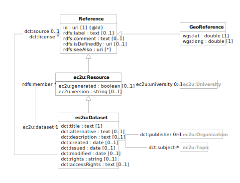

> **⚠️** **Work in progress…**

Datasets published on the EC2U Knowledge Hub.

Catalog entries include human and machine-readable dataset descriptions and basic information about
license and access rights for partners and other stakeholders.

External supporting datasets may also be listed in the catalog for reference and ease of access.

# Data Model

EC2U datasets are described using a controlled subset
of the  [VoID](https://www.w3.org/TR/void/) data model, as outlined by
the [Describing Linked Datasets with the VoID Vocabulary](https://www.w3.org/TR/void/) W3C Internet Group Note.

| prefix | namespace                             | definition                                                                                                                |
|--------|---------------------------------------|---------------------------------------------------------------------------------------------------------------------------|
| ec2u:  | https://data.ec2u.eu/terms/           | EC2U Knowledge Hub vocabulary                                                                                             |
| dct:   | http://purl.org/dc/terms/             | [Dublin Core](https://www.dublincore.org) [DCMI Terms](https://www.dublincore.org/specifications/dublin-core/dcmi-terms/) |
| rdfs:  | http://www.w3.org/2000/01/rdf-schema# | [RDF Schema 1.1 (RDFS)](https://www.w3.org/TR/rdf11-schema/) vocabulary                                                   |
| void:  | http://rdfs.org/ns/void#              | [Vocabulary of Interlinked Datasets (VoID)](http://vocab.deri.ie/void)                                                    |

## Dataset

| term                                                                                                   | type                                                                                | #    | description                                                                                                                                                  |
|--------------------------------------------------------------------------------------------------------|-------------------------------------------------------------------------------------|------|--------------------------------------------------------------------------------------------------------------------------------------------------------------|
| **ec2u:Dataset**                                                                                       | [ec2u:Resource](resources.md),  [void:Dataset](https://www.w3.org/TR/void/#dataset) |      | EC2U Knowledge Hub dataset                                                                                                                                   |
| [rdfs:isDefinedBy](https://www.w3.org/TR/rdf-schema/#ch_isdefinedby)                                   | id                                                                                  | 1    | link to the data model specification                                                                                                                         |
| [dct:title](https://www.dublincore.org/specifications/dublin-core/dcmi-terms/terms/title/)             | text                                                                                | 1    | complete name                                                                                                                                                |
| [dct:alternative](https://www.dublincore.org/specifications/dublin-core/dcmi-terms/terms/alternative/) | text                                                                                | 0..1 | shortened / informal name                                                                                                                                    |
| [dct:description](https://www.dublincore.org/specifications/dublin-core/dcmi-terms/terms/description/) | text                                                                                | 0..1 | content and intended usage description                                                                                                                       |
| [dct:created](https://www.dublincore.org/specifications/dublin-core/dcmi-terms/terms/created/)         | date                                                                                | 0..1 | creation date                                                                                                                                                |
| [dct:issued](https://www.dublincore.org/specifications/dublin-core/dcmi-terms/terms/issued/)           | date {≥ dct:created}                                                                | 0..1 | formal issuance date; only datasets with a defined issuance date are exposed through user facing search interfaces                                           |
| [dct:modified](https://www.dublincore.org/specifications/dublin-core/dcmi-terms/terms/modified/)       | date {≥ dct:created}                                                                | 0..1 | latest modification date                                                                                                                                     |
| [dct:rights](https://www.w3.org/TR/vocab-dcat-2/#Property:resource_rights)                             | string                                                                              | 1    | copyright statement (for instance, `Copyright © 2022 EC2U Alliance`)                                                                                         |
| [dct:license](https://www.w3.org/TR/vocab-dcat-2/#Property:resource_license)                           | id                                                                                  | 0..1 | link to the public text of the licensing terms for the dataset as a whole; entries in the catalog may define their own licensing terms                       |
| [dct:accessRights](https://www.w3.org/TR/vocab-dcat-2/#Property:resource_access_rights)                | text                                                                                | 0..1 | human-readable, localised description of access rights and policies for partners and other stakeholders                                                      |
| [dct:publisher](https://www.dublincore.org/specifications/dublin-core/dcmi-terms/terms/publisher/)     | [ec2u:Publisher](#publisher)                                                        | 0..1 | link to the organisation responsible for publishing the dataset                                                                                              |
| **void:Dataset**                                                                                       |                                                                                     |      |                                                                                                                                                              |
| [void:rootEntity](https://www.w3.org/TR/void/#root-resource)                                           | id                                                                                  | *    | links to dataset entry points; may be an [rdfs:Class](https://www.w3.org/TR/rdf-schema/#ch_class)                                                            |
| [void:entities](https://www.w3.org/TR/void/#statistics)                                                | integer                                                                             | 0..1 | count of the principal entities in the dataset; if `void:rootEntity` is an an `rdfs:Class`, the count refers to the resources that are instance of the class |
| [void:subset](https://www.w3.org/TR/void/#subset)                                                      | [void:Dataset](https://www.w3.org/TR/void/#dataset)                                 | *    | link to a dataset partition, possibly qualified by EC2U partner using the `ec2u:owner`  property                                                             |

# Licensing

Individual datasets included in the catalog are licensed by their respective publishers under the licensing terms
specified by
the [`dct:rights`](https://www.w3.org/TR/vocab-dcat-2/#Property:resource_rights), [`dct:license `](https://www.w3.org/TR/vocab-dcat-2/#Property:resource_license)
and  [`dct:accessRights`](https://www.w3.org/TR/vocab-dcat-2/#Property:resource_access_rights) properties as described
above.

# Sources

* static content from application source code
* manually curated database content

## Updating

* static content is updated on demand by manually editing application source code
