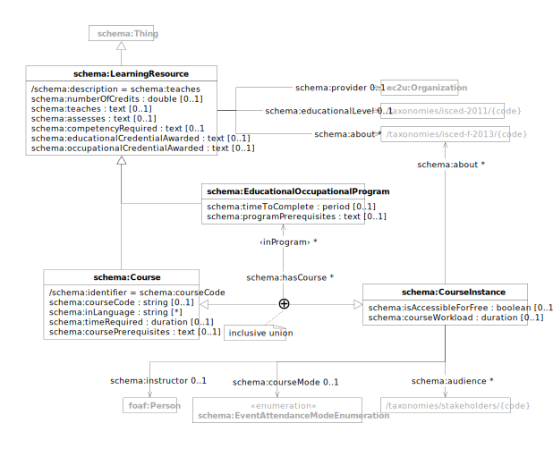

# Data Model

EC2U educational offerings are described using a controlled subset of
the [schema:LearningResource](https://schema.org/LearningResource), [schema:EducationalOccupationalProgram](https://schema.org/EducationalOccupationalProgram)
and  [schema:Course](https://schema.org/Course) data models.

| prefix  | namespace           | definition                                   |
|---------|---------------------|----------------------------------------------|
| schema: | https://schema.org/ | [Schema.org](https://schema.org/) vocabulary |

## Offering

| term                                                                                     | type                                       | #    | description                                                                                                                                                                                                                                                      |
|------------------------------------------------------------------------------------------|--------------------------------------------|------|------------------------------------------------------------------------------------------------------------------------------------------------------------------------------------------------------------------------------------------------------------------|
| **[schema:LearningResource](https://schema.org/LearningResource)**                       | [schema:Thing](things.md#thing)            |      | educational offering                                                                                                                                                                                                                                             |
| [schema:provider](https://schema.org/provider)                                           | [org:Organization](agents.md#organization) | 0..1 | link to the resource provider                                                                                                                                                                                                                                    |
| [schema:teaches](https://schema.org/teaches)                                             | text                                       | 0..1 | general description of goals,  learning contents and teaching approach                                                                                                                                                                                           |
| [schema:assesses](https://schema.org/assesses)                                           | text                                       | 0..1 | detailed description of expected final competencies or learning outcomes                                                                                                                                                                                         |
| [schema:numberOfCredits](https://schema.org/numberOfCredits)                             | decimal                                    | 0..1 | number of [European Credit Transfer and Accumulation System (ECTS)](https://education.ec.europa.eu/education-levels/higher-education/inclusive-and-connected-higher-education/european-credit-transfer-and-accumulation-system) credits on successful completion |
| [schema:educationalCredentialAwarded](https://schema.org/educationalCredentialAwarded)   | text                                       | 0..1 | description of the qualification, award, certificate, diploma or other educational credential awarded on successful completion                                                                                                                                   |
| [schema:occupationalCredentialAwarded](https://schema.org/occupationalCredentialAwarded) | text                                       | 0..1 | description of the qualification, award, certificate, diploma or other occupational credential awarded on successful completion                                                                                                                                  |
| [schema:educationalLevel](https://schema.org/educationalLevel)                           | [skos:Concept](concepts.md#concept)        | 0..1 | educational level of the resource as a link to an entry in the [ISCED 2011](/concepts/isced-2011) taxonomy                                                                                                                                                       |
| [schema:learningResourceType](https://schema.org/learningResourceType)                   | [skos:Concept](concepts.md#concept)        | *    | resource type as a link to an entry in the [EC2U Offering Types](/concepts/offering-types) taxonomy                                                                                                                                                              |
| [schema:about](https://schema.org/about)                                                 | [skos:Concept](concepts.md#concept)        | *    | resource topics as links to  entries in the [EuroSciVoc](/concepts/euroscivoc) taxonomy                                                                                                                                                                          |
| [schema:occupationalCategory](https://schema.org/occupationalCategory)                   | [skos:Concept](concepts.md#concept)        | *    | target occupational sectors of the resource as links to entries in the [ESCO Occupations](/concepts/esco-occupations) taxonomy                                                                                                                                   |
| [schema:competencyRequired](https://schema.org/competencyRequired)                       | [skos:Concept](concepts.md#concept)        | *    | knowledge, skill, ability to be demonstrated in order to earn related educational or occupational credentials as links to entries [ESCO Skills](/concepts/esco-skills) taxonomy                                                                                  |

> **⚠️**`learningResourceType`values to be migrated to a standardised taxonomy

> `❓` Any European-wide standardised taxonomic for `educational/occupationaCredentialAwarded` values?

## Program

A program offered by an institution which determines the learning progress to achieve an outcome, usually a credential
like a degree or certificate. This would define a discrete set of opportunities (for instance, courses) that together
constitute a program.

| term                                                                                           | type                                          | #    | description                                                                                                                                                                                                  |
|------------------------------------------------------------------------------------------------|-----------------------------------------------|------|--------------------------------------------------------------------------------------------------------------------------------------------------------------------------------------------------------------|
| **[schema:EducationalOccupationalProgram](https://schema.org/EducationalOccupationalProgram)** | [schema:LearningResource](#learning-resource) |      | educational or occupational program                                                                                                                                                                          |
| [schema:programType](https://schema.org/programType)                                           | [skos:Concept](concepts.md#concept)           | 0..1 | program type as a link to an entry in the [EC2U Offering Types](/concepts/offering-types) taxonomy                                                                                                           |
| [schema:timeToComplete](https://schema.org/timeToComplete)                                     | duration                                      | 0..1 | expected length of time to complete the program if attending full-time, as a [ISO 8601 duration](https://en.wikipedia.org/wiki/ISO_8601#Durations) value (e.g. `P6M` for 6 months or `PT120H` for 120 hours) |
| [schema:programPrerequisites](https://schema.org/programPrerequisites)                         | text                                          | 0..1 | description of enrolment requirements                                                                                                                                                                        |
| [schema:hasCourse](https://schema.org/hasCourse)                                               | [schema:Course](#course)                      | *    | links to the courses that are part of the program                                                                                                                                                            |

## Course

An educational course which may be offered as distinct instances which take place at different times or take place at
different locations, or be offered through different media or modes of study.

| term                                                                 | type                                              |      | description                                                                                                                                          |
|----------------------------------------------------------------------|---------------------------------------------------|------|------------------------------------------------------------------------------------------------------------------------------------------------------|
| **[schema:Course](https://schema.org/Course)**                       | [schema:LearningResource](#learning-resource)     |      | educational or occupational course                                                                                                                   |
| [schema:courseCode](https://schema.org/courseCode)                   | string                                            | 0..1 | course identifier assigned by the course provider                                                                                                    |
| [schema:inLanguage](https://schema.org/inLanguage)                   | string                                            | 0..1 | 2-letters [IETF BCP 47](http://tools.ietf.org/html/bcp47) code of the teaching / evaluation language (for instance, `en` )                           |
| [schema:timeRequired](https://schema.org/timeRequired)               | duration                                          | 0..1 | scheduled workload in [ISO 8601 duration](https://www.w3.org/TR/xmlschema-2/#duration) format; hour‑based duration (e.g. `PT60H`) strongly suggested |
| [schema:coursePrerequisites](https://schema.org/coursePrerequisites) | text                                              | 0..1 | description of admission requirements                                                                                                                |
| ‹inProgram› = ^[schema:hasCourse](https://schema.org/hasCourse)      | [schema:EducationalOccupationalProgram](#program) | *    | links to the programs the course is part of                                                                                                          |

## Course Instance

| term                                                                 | type                                                                                       |        | description                                                                                                                                                    |
|----------------------------------------------------------------------|--------------------------------------------------------------------------------------------|--------|----------------------------------------------------------------------------------------------------------------------------------------------------------------|
| **[schema:CourseInstance](https://schema.org/CourseInstance)**       | [schema:Thing](things.md#thing)                                                            |        | specific instance of an educational or occupational course                                                                                                     |
| [schema:isAccessibleForFree](https://schema.org/isAccessibleForFree) | boolean                                                                                    | 0..1   | flag signalling whether the course is accessible for free to external users                                                                                    |
| [schema:courseWorkload](https://schema.org/courseWorkload)           | duration                                                                                   | 0..1   | expected individual workload in [ISO 8601 duration](https://www.w3.org/TR/xmlschema-2/#duration) format; hour‑based duration (e.g. `PT60H`) strongly suggested |
| [schema:instructor](https://schema.org/instructor)                   | [foaf:Person](agents.md#person)                                                            | *0..1* | a reference to the main instructor                                                                                                                             |
| [schema:courseMode](https://schema.org/courseMode)                   | [schema:EventAttendanceModeEnumeration](https://schema.org/EventAttendanceModeEnumeration) | 0..1   | course attendance mode                                                                                                                                         |
| [schema:audience](https://schema.org/audience)                       | enumeration<string>                                                                        | *      | accepted audience                                                                                                                                              |
|                                                                      | “Lifelong Learning”                                                                        |        | member of the general public interested in professional or personal development opportunities                                                                  |

