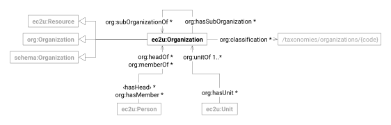

EC2U organizations are described using a controlled subset of
the  [W3C Organization Ontology](../about/vocabularies/org.md) and [Schema.org](../about/vocabularies/schema.md)
data models.

| prefix  | namespace                   | description                   |
|---------|-----------------------------|-------------------------------|
| ec2u:   | https://data.ec2u.eu/terms/ | EC2U Knowledge Hub vocabulary |
| org:    | http://www.w3.org/ns/org#   | [The Organization Ontology]   |
| schema: | https://schema.org/         | [Schema.org] vocabulary       |

# Organization

| term                     | type                                                       | # | description                                                           |
|--------------------------|------------------------------------------------------------|---|-----------------------------------------------------------------------|
| **ec2u:Organization**    | [ec2u:Resource], [org:Organization], [schema:Organization] |   | EC2U Knowledge Hub organization                                       |
| [org:classification]     | [ec2u:Topic]                                               | * | links to organization types in the [EC2U Organization Types] taxonomy |
| [org:subOrganizationOf]  | [ec2u:Organization]                                        | * | links to parent organizations                                         |
| [org:hasSubOrganization] | [ec2u:Organization]                                        | * | links to child organizations                                          |
| [org:hasUnit]            | [ec2u:Unit]                                                | * | links to organizational units                                         |
| [org:hasHead]            | [ec2u:Person]                                              | * | links to persons heading the organization                             |
| [org:hasMember]          | [ec2u:Person]                                              | * | links to members of the organization                                  |

[The Organization Ontology]: https://www.w3.org/TR/vocab-org/

[Schema.org]: https://schema.org/

[ec2u:Resource]: ./index.md#resource

[org:Organization]: ../about/vocabularies/org.md#organization

[schema:Organization]: ../about/vocabularies/schema.md#organization

[org:classification]: https://www.w3.org/TR/vocab-org/#org:classification

[ec2u:Topic]: taxonomies.md#topic

[EC2U Organization Types]: /taxonomies/organizations/

[org:subOrganizationOf]: https://www.w3.org/TR/vocab-org/#org:subOrganizationOf

[ec2u:Organization]: #organization

[org:hasSubOrganization]: https://www.w3.org/TR/vocab-org/#org:hasSubOrganization

[org:hasUnit]: https://www.w3.org/TR/vocab-org/#org:hasUnit

[ec2u:Unit]: units.md#unit

[org:hasHead]: https://www.w3.org/TR/vocab-org/#org:hasHead

[ec2u:Person]: persons.md#person

[org:hasMember]: https://www.w3.org/TR/vocab-org/#org:hasMember
