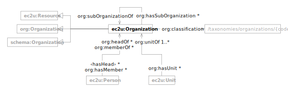

EC2U organizations are described using a controlled subset of
the  [W3C Organization Ontology](../about/vocabularies/org.md) and [Schema.org](../about/vocabularies/schema.md)
data models.

| prefix  | namespace                   | description                                                   |
|---------|-----------------------------|---------------------------------------------------------------|
| ec2u:   | https://data.ec2u.eu/terms/ | EC2U Knowledge Hub vocabulary                                 |
| org:    | http://www.w3.org/ns/org#   | [The Organization Ontology](https://www.w3.org/TR/vocab-org/) |
| schema: | https://schema.org/         | [Schema.org](https://schema.org/) vocabulary                  |

# Organization

| term                                                                              | type                                                                                                                                                                     | # | description                                                                                       |
|-----------------------------------------------------------------------------------|--------------------------------------------------------------------------------------------------------------------------------------------------------------------------|---|---------------------------------------------------------------------------------------------------|
| **ec2u:Organization**                                                             | [ec2u:Resource](./index.md#resource), [org:Organization](../about/vocabularies/org.md#organization), [schema:Organization](../about/vocabularies/schema.md#organization) |   | EC2U Knowledge Hub organization                                                                   |
| [org:classification](https://www.w3.org/TR/vocab-org/#org:classification)         | [ec2u:Topic](taxonomies.md#topic)                                                                                                                                        | * | links to organization types in the [EC2U Organization Types](/taxonomies/organizations/) taxonomy |
| [org:subOrganizationOf](https://www.w3.org/TR/vocab-org/#org:subOrganizationOf)   | [ec2u:Organization](#organization)                                                                                                                                       | * | links to parent organizations                                                                     |
| [org:hasSubOrganization](https://www.w3.org/TR/vocab-org/#org:hasSubOrganization) | [ec2u:Organization](#organization)                                                                                                                                       | * | links to child organizations                                                                      |
| [org:hasUnit](https://www.w3.org/TR/vocab-org/#org:hasUnit)                       | [ec2u:Unit](units.md#unit)                                                                                                                                               | * | links to organizational units                                                                     |
| [org:hasHead](https://www.w3.org/TR/vocab-org/#org:hasHead)                       | [ec2u:Person](persons.md#person)                                                                                                                                         | * | links to persons heading the organization                                                         |
| [org:hasMember](https://www.w3.org/TR/vocab-org/#org:hasMember)                   | [ec2u:Person](persons.md#person)                                                                                                                                         | * | links to members of the organization                                                              |
