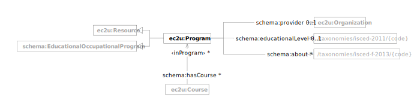

EC2U programs are described using a controlled subset of the [Schema.org](../about/vocabularies/schema-resource.md) data
model.

| prefix  | namespace                   | description                                  |
|---------|-----------------------------|----------------------------------------------|
| ec2u:   | https://data.ec2u.eu/terms/ | EC2U Knowledge Hub vocabulary                |
| schema: | https://schema.org/         | [Schema.org](https://schema.org/) vocabulary |

# Program

| term                                                           | type                                                                                                                                                     | #    | description                                                                                        |
|----------------------------------------------------------------|----------------------------------------------------------------------------------------------------------------------------------------------------------|------|----------------------------------------------------------------------------------------------------|
| **ec2u:Program**                                               | [ec2u:Resource](./index.md#resource), [schema:EducationalOccupationalProgram](../about/vocabularies/schema-resource.md#educational-occupational-program) |      | EC2U Knowledge Hub program                                                                         |
| [schema:hasCourse](https://schema.org/hasCourse)               | [ec2u:Course](courses.md#course)                                                                                                                         | *    | links to courses included in the program                                                           |
| [schema:provider](https://schema.org/provider)                 | [ec2u:Organization](organizations.md#organization)                                                                                                       | 1    | link to the organization providing the program                                                     |
| [schema:educationalLevel](https://schema.org/educationalLevel) | [ec2u:Topic](taxonomies.md#topic)                                                                                                                        | 0..1 | link to the educational level in the [ISCED 2011](/taxonomies/isced-2011/) taxonomy                |
| [schema:about](https://schema.org/about)                       | [ec2u:Topic](taxonomies.md#topic)                                                                                                                        | *    | links to educational and training fields in the [ISCED-F 2013](/taxonomies/isced-f-2013/) taxonomy |
