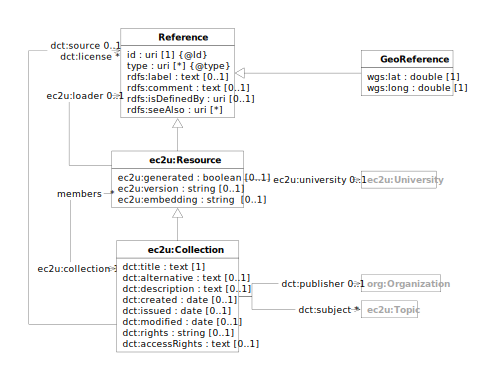

> **⚠️** **Work in progress…**

# Data Model

EC2U entities are described using a controlled subset of
the [Dublin Core](https://www.dublincore.org/specifications/dublin-core/dcmi-terms/) data model.

All generic human-readable labels and descriptions are localized either in English or in one of the local EC2U partner
languages.

| prefix | namespace                                   | description                                                                                                               |
|--------|---------------------------------------------|---------------------------------------------------------------------------------------------------------------------------|
| ec2u:  | https://data.ec2u.eu/terms/                 | EC2U Knowledge Hub vocabulary                                                                                             |
| dct:   | http://purl.org/dc/terms/                   | [Dublin Core](https://www.dublincore.org) [DCMI Terms](https://www.dublincore.org/specifications/dublin-core/dcmi-terms/) |
| rdf:   | http://www.w3.org/1999/02/22-rdf-syntax-ns# | [Resource Description Framework 1.1 (RDF)](https://www.w3.org/TR/2014/REC-rdf11-concepts-20140225/) vocabulary            |
| rdfs:  | http://www.w3.org/2000/01/rdf-schema#       | [RDF Schema 1.1 (RDFS)](https://www.w3.org/TR/rdf11-schema/) vocabulary                                                   |
| skos:  | http://www.w3.org/2004/02/skos/core#        | [Simple Knowledge Organization System (SKOS)](https://www.w3.org/TR/skos-reference/) vocabulary                           |

## Resource

> *:information_source:* The resource data model is not intended to be used in isolation but only to provide a base
> definition factoring generic properties shared by the specialised models defined by each [dataset](index.md).

| term                                                                                                   | type                                          | #      | definition                                                                                                                               |
|--------------------------------------------------------------------------------------------------------|-----------------------------------------------|--------|------------------------------------------------------------------------------------------------------------------------------------------|
| ***[rdfs:Resource](https://www.w3.org/TR/rdf-schema/#ch_resource)***                                   |                                               |        | a resource included in the EC2U Knowledge Hub                                                                                            |
| [rdfs:label](https://www.w3.org/TR/rdf-schema/#ch_label)                                               | text {maxLength(100)}                         | 1      | a human readable label for the resource; should uniquely identify the entity even out of context and optimally not exceed 50 characters  |
| [rdfs:comment](https://www.w3.org/TR/rdf-schema/#ch_comment)                                           | text {maxLength(1000)}                        | 0..1   | a human readable label for the resource; should uniquely identify the entity even out of context and optimally not exceed 250 characters |
| [rdfs:isDefinedBy](https://www.w3.org/TR/rdf-schema/#ch_isdefinedby)                                   | id                                            | [0..1] | a link to a human or machine-readable specification providing a formal definition of the resource or its data model                      |
| [rdfs:seeAlso](https://www.w3.org/TR/rdf-schema/#ch_seealso)                                           | id                                            | *      | links to other resource describing the same subject                                                                                      |
| **ec2u:Resource**                                                                                      | [rdfs:Resource](#resource)                    |        | a resource included in one of the EC2U Knowledge Hub datasets                                                                            |
| [rdf:type](https://www.w3.org/TR/rdf-schema/#ch_type)                                                  | id                                            | 1..*   | link2 to the RDF classes the resource belongs to                                                                                         |
| [dct:title](https://www.dublincore.org/specifications/dublin-core/dcmi-terms/terms/title/)             | text                                          | 1      | the human-readable, localised name of the resource                                                                                       |
| [dct:description](https://www.dublincore.org/specifications/dublin-core/dcmi-terms/terms/description/) | text                                          | 0..1   | a human-readable, localised description of the resource                                                                                  |
| [dct:publisher](https://www.dublincore.org/specifications/dublin-core/dcmi-terms/terms/publisher/)     | [ec2u:Publisher](#publisher)                  | 0..1   | a link to the organisation responsible for making the resource available                                                                 |
| [dct:source](https://www.dublincore.org/specifications/dublin-core/dcmi-terms/terms/source/)           | id                                            | 0..1   | a link to a related resource from which the described resource is derived                                                                |
| [dct:created](https://www.dublincore.org/specifications/dublin-core/dcmi-terms/terms/created/)         | instant                                       | 0..1   | the creation timestamp of the resource                                                                                                   |
| [dct:issued](https://www.dublincore.org/specifications/dublin-core/dcmi-terms/terms/issued/)           | instant {≥ dct:created}                       | 0..1   | the formal issuance timestamp of the resource                                                                                            |
| [dct:modified](https://www.dublincore.org/specifications/dublin-core/dcmi-terms/terms/modified/)       | instant {≥ dct:created}                       | 0..1   | the latest modification timestamp of the resource                                                                                        |
| [dct:type](https://www.dublincore.org/specifications/dublin-core/dcmi-terms/terms/type/)               | [skos:Concept](concepts.md#concept)           | *      | links to classification categories for the resource; must reference SKOS concepts managed by the *Knowledge Hub*                         |
| [dct:subject](https://www.dublincore.org/specifications/dublin-core/dcmi-terms/terms/subject/)         | [skos:Concept](concepts.md#concept)           | *      | links to topics for the resource; must reference SKOS concepts managed by the *Knowledge Hub*                                            |
| ec2u:version                                                                                           | instant                                       | 0..1   | the uploading timestamp of the current resource version                                                                                  |
| ec2u:university                                                                                        | [ec2u:University](universities.md#university) | 0..1   | a link to an EC2U partner university associated with the resource                                                                        |

## Publisher

| term                                                                                             | type                       | #    | description                                                                      |
|--------------------------------------------------------------------------------------------------|----------------------------|------|----------------------------------------------------------------------------------|
| **ec2u:Resource**                                                                                | [ec2u:Resource](#resource) |      | an entity entity responsible for making an EC2U Knowledge Hub resource available |
| [dct:coverage](https://www.dublincore.org/specifications/dublin-core/dcmi-terms/terms/coverage/) | enumeration                | 0..1 | ❗️TBC                                                                            |
|                                                                                                  | ec2u:University            |      |                                                                                  |
|                                                                                                  | ec2u:College               |      |                                                                                  |
|                                                                                                  | ec2u:Association           |      |                                                                                  |
|                                                                                                  | ec2u:Other                 |      |                                                                                  |

> ❓Convert `ec2u:Coverage` to concept scheme?

