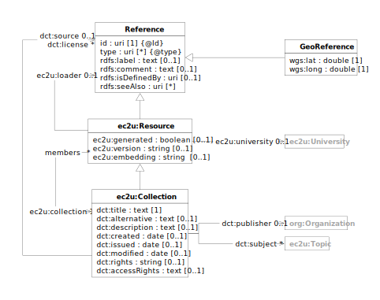

# Data Model

EC2U resources are described using a controlled subset
of the [RDF Schema 1.1 (RDFS)](https://www.w3.org/TR/rdf11-schema/) data model, extended with some internal
housekeeping properties.

| prefix | namespace                                   | description                                                                                                    |
|--------|---------------------------------------------|----------------------------------------------------------------------------------------------------------------|
| ec2u:  | https://data.ec2u.eu/terms/                 | EC2U Knowledge Hub vocabulary                                                                                  |
| rdf:   | http://www.w3.org/1999/02/22-rdf-syntax-ns# | [Resource Description Framework 1.1 (RDF)](https://www.w3.org/TR/2014/REC-rdf11-concepts-20140225/) vocabulary |
| rdfs:  | http://www.w3.org/2000/01/rdf-schema#       | [RDF Schema 1.1 (RDFS)](https://www.w3.org/TR/rdf11-schema/) vocabulary                                        |

## Reference

## GeoReference

## Resource

> [!WARNING]
> The `rdfs:Resource` data model is not intended to be used in isolation but only to provide base
> definitions factoring generic properties shared by the specialised models defined by each [dataset](./index.md).

| term                                                                    | type                                  | #    | definition                                                                                                                                   |
|-------------------------------------------------------------------------|---------------------------------------|------|----------------------------------------------------------------------------------------------------------------------------------------------|
| ***[rdfs:Resource](https://www.w3.org/TR/rdf-schema/#ch_resource)***    |                                       |      | a resource included in the EC2U Knowledge Hub                                                                                                |
| id                                                                      | uri                                   | 1    | unique resource identifier                                                                                                                   |
| [rdf:type](https://www.w3.org/TR/rdf-schema/#ch_type)                   | uri                                   | *    | links to RDF classes the resource is an instance of                                                                                          |
| [rdfs:label](https://www.w3.org/TR/rdf-schema/#ch_label)                | text {maxLength(100)}                 | 0..1 | human readable label for the resource; should uniquely identify the entity even out of context and optimally not exceed 50 characters        |
| [rdfs:comment](https://www.w3.org/TR/rdf-schema/#ch_comment)            | text {maxLength(500)}                 | 0..1 | human readable description of the resource; should uniquely describe the entity even out of context and optimally not exceed 500 characters  |
| [rdfs:seeAlso](https://www.w3.org/TR/rdf-schema/#ch_seealso)            | uri                                   | *    | links to other resource describing the same subject                                                                                          |
| [rdfs:isDefinedBy](https://www.w3.org/TR/rdf-schema/#ch_isdefinedby)    | uri                                   | 0..1 | link to a human or machine-readable specification providing a formal definition of the resource or its data model                            |
| ‹dataset› = ^[rdfs:member](https://www.w3.org/TR/rdf-schema/#ch_member) | [void:Dataset](./index.md)            | *    | links to the EC2U Knowledge Hub datasets the resource belongs to                                                                             |
| ec2u:university                                                         | [ec2u:University](universities.md)    | 0..1 | link to a EC2U partner university associated with the resource                                                                               |
| ec2u:concept                                                            | [skos:Concept](taxonomies.md#concept) | *    | links to related classification concepts                                                                                                     |
| ec2u:generated                                                          | boolean                               | 1    | `true` if the resource description was at least partially  generated by means of automated AI-based analysis; `false` or undefined otherwise |
| ec2u:version                                                            | string                                | 0..1 | version identifier for the resource                                                                                                          |
| collection                                                              | Collection                            | 1    | link to the collection the resource belongs to                                                                                               |

> [!NOTE]
>
> Human-readable labels and descriptions are localised either in English or in one of the local EC2U partner
> university languages.
>

## Collection
