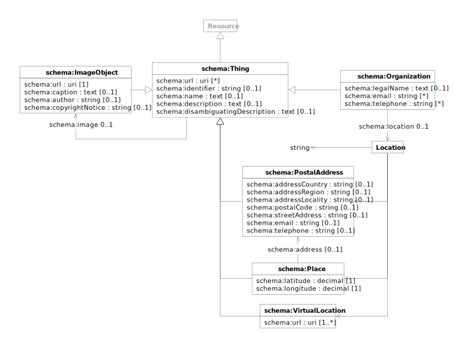

# Data Model

Things are described using a controlled subset of the [schema.org](https://schema.org) data model, where property types
and cardinality are tightly specified and constrained.

| prefix  | namespace           | definition                                   |
|---------|---------------------|----------------------------------------------|
| schema: | https://schema.org/ | [Schema.org](https://schema.org/) vocabulary |

## Thing

> **⚠️** The `schema:Thing` data model is not intended to be used in isolation but only to provide base
> definitions factoring generic properties shared by the specialised models defined by each [dataset](./index.md).

| term                                                                             | type                                   | #    | description                                                    |
|----------------------------------------------------------------------------------|----------------------------------------|------|----------------------------------------------------------------|
| **[schema:Thing](https://schema.org/Thing)**                                     | [rdfs:Resource](resources.md#resource) |      | generic item                                                   |
| [schema:url](https://schema.org/url)                                             | id                                     | *    | links to public web pages describing the item                  |
| [schema:identifier](https://schema.org/identifier)                               | string                                 | *    | formal identifiers assigned by the item owner                  |
| [schema:name](https://schema.org/name)                                           | text                                   | 0..1 | item name                                                      |
| [schema:image](https://schema.org/image)                                         | [rdfs:Resource](resources.md#resource) | 0..1 | link to an image of the item                                   |
| [schema:description](https://schema.org/description)                             | text                                   | 0..1 | extended  description of the item                              |
| [schema:disambiguatingDescription](https://schema.org/disambiguatingDescription) | text                                   | 0..1 | short description intended to identify the item out of context |

## Organization

| term                                                       | type                                                               | #    | description                                  |
|------------------------------------------------------------|--------------------------------------------------------------------|------|----------------------------------------------|
| **[schema:Organization](https://schema.org/Organization)** | [schema:Thing](#thing), [org:Organization](agents.md#organization) |      | organised agent                              |
| [schema:legalName](https://schema.org/legalName)           | text                                                               | 0..1 | legally recognised name of the organisation  |
| [schema:email](https://schema.org/email)                   | string                                                             | ▪    | contact email addresses for the organisation |
| [schema:telephone](https://schema.org/telephone)           | string                                                             | ▪    | contact phone numbers for the organisation   |
| [schema:location](https://schema.org/location)             | [Location](#location)                                              | 0..1 | location of the main organisation site       |

## Location

| term              | type                                        | #    | description                                 |
|-------------------|---------------------------------------------|------|---------------------------------------------|
| ‹Text›            | string                                      | 0..1 | location as a free-form textual description |
| ‹PostalAddress›   | [schema:PostalAddress](#postal-address)     | 0..1 | location as a postal address                |
| ‹Place›           | [schema:Place](#place)                      | 0..1 | location as a place                         |
| ‹VirtualLocation› | [schema:VirtualLocation](#virtual-location) | 0..1 | location as a virtual location              |

## Postal Address

| term                                                         | type                                   | #    | description                                 |
|--------------------------------------------------------------|----------------------------------------|------|---------------------------------------------|
| **[schema:PostalAddress](https://schema.org/PostalAddress)** | [schema:Thing](#thing)                 |      | postal delivery address                     |
| [schema:addressCountry](https://schema.org/addressCountry)   | [rdfs:Resource](resources.md#resource) | 0..1 | link to the location country                |
| [schema:addressRegion](https://schema.org/addressRegion)     | [rdfs:Resource](resources.md#resource) | 0..1 | link to the location region                 |
| [schema:addressLocality](https://schema.org/addressLocality) | [rdfs:Resource](resources.md#resource) | 0..1 | link to the location location               |
| [schema:postalCode](https://schema.org/postalCode)           | string                                 | 0..1 | location postal code                        |
| [schema:streetAddress](https://schema.org/streetAddress)     | string                                 | 0..1 | location street address                     |
| [schema:email](https://schema.org/email)                     | string                                 | 0..1 | main contact email address for the location |
| [schema:telephone](https://schema.org/telephone)             | string                                 | 0..1 | main contact phone number for the location  |

## Place

| term                                             | type                                    | #    | description           |
|--------------------------------------------------|-----------------------------------------|------|-----------------------|
| **[schema:Place](https://schema.org/Place)**     | [schema:Thing](#thing)                  |      | physical location     |
| [schema:address](https://schema.org/address)     | [schema:PostalAddress](#postal-address) | 0..1 | place postal address  |
| [schema:latitude](https://schema.org/latitude)   | decimal                                 | 0..1 | place WGS84 latitude  |
| [schema:longitude](https://schema.org/longitude) | decimal                                 | 0..1 | place WGS84 longitude |

## Virtual Location

| term                                                             | type                   | # | description                                                |
|------------------------------------------------------------------|------------------------|---|------------------------------------------------------------|
| **[schema:VirtualLocation](https://schema.org/VirtualLocation)** | [schema:Thing](#thing) |   | online virtual location, for instance for attending events |
| [schema:url](https://schema.org/url)                             | id                     | 1 | link to the public web page hosting the virtual location   |
