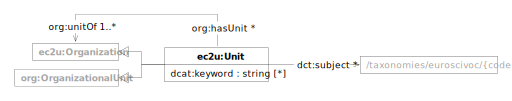

EC2U research units and facilities are described using a controlled subset of
the [W3C Organization Ontology](../about/vocabularies/org.md) data model, extended
with [Dublin Core](https://www.dublincore.org/specifications/dublin-core/dcmi-terms/) properties.

| prefix | namespace                   | description                                                                                                               |
|--------|-----------------------------|---------------------------------------------------------------------------------------------------------------------------|
| ec2u:  | https://data.ec2u.eu/terms/ | EC2U Knowledge Hub vocabulary                                                                                             |
| org:   | http://www.w3.org/ns/org#   | [The Organization Ontology](https://www.w3.org/TR/vocab-org/)                                                             |
| dct:   | http://purl.org/dc/terms/   | [Dublin Core](https://www.dublincore.org) [DCMI Terms](https://www.dublincore.org/specifications/dublin-core/dcmi-terms/) |

# Unit

| term                                                                                                              | type                                                                                                                           | # | definition                                                                                                     |
|-------------------------------------------------------------------------------------------------------------------|--------------------------------------------------------------------------------------------------------------------------------|---|----------------------------------------------------------------------------------------------------------------|
| **ec2u:Unit**                                                                                                     | [ec2u:Organization](organizations.md#organization), [org:OrganizationalUnit](../about/vocabularies/org.md#organizational-unit) |   | a [university](universities.md#university) organizational unit involved with or supporting research activities |
| [dct:subject](https://www.dublincore.org/specifications/dublin-core/dcmi-terms/#http://purl.org/dc/terms/subject) | [ec2u:Topic](taxonomies.md#topic)                                                                                              | * | links to related research topics in the [EuroSciVoc](/taxonomies/euroscivoc/) taxonomy                         |
| [org:unitOf](https://www.w3.org/TR/vocab-org/#org:unitOf)                                                         | [ec2u:Organization](organizations.md#organization)                                                                             | * | links to organizations this units belongs to                                                                   |
