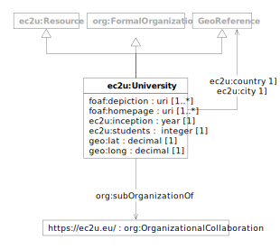

EC2U allied universities are described using a controlled subset of
the [W3C Organization Ontology](../about/vocabularies/org.md) data model, extended with some specialised
properties.

| prefix | namespace                   | description                                                         |
|--------|-----------------------------|---------------------------------------------------------------------|
| ec2u:  | https://data.ec2u.eu/terms/ | EC2U Knowledge Hub vocabulary                                       |
| foaf:  | http://xmlns.com/foaf/0.1/  | [Friend of a Friend (FOAF)](http://xmlns.com/foaf/spec/) vocabulary |
| org:   | http://www.w3.org/ns/org#   | [The Organization Ontology](https://www.w3.org/TR/vocab-org/)       |

# University

| term                                                         | type                                                                                                                                                         | #    | definition                                        |
|--------------------------------------------------------------|--------------------------------------------------------------------------------------------------------------------------------------------------------------|------|---------------------------------------------------|
| **ec2u:University**                                          | [ec2u:Resource](./index.md#resource), [org:FormalOrganization](../about/vocabularies/org.md#formal-organization), [*GeoReference*](./index.md#geo-reference) |      | EC2U allied university                            |
| [foaf:depiction](http://xmlns.com/foaf/spec/#term_depiction) | uri                                                                                                                                                          | 1    | the URL of an institutional outdoor image         |
| [foaf:homepage](http://xmlns.com/foaf/spec/#term_homepage)   | uri                                                                                                                                                          | 1..* | URLs of the university homepages                  |
| ec2u:inception                                               | year                                                                                                                                                         | 1    | the inception year of the university              |
| ec2u:students                                                | integer                                                                                                                                                      | 1    | the number of students enrolled at the university |
| ec2u:city                                                    | [*GeoReference*](./index.md#geo-reference)                                                                                                                   | 1    | link to the city of the university                |
| ec2u:country                                                 | [*GeoReference*](./index.md#geo-reference)                                                                                                                   | 1    | link to the country of the university             |
