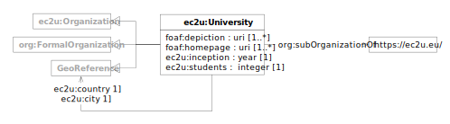

# Data Model

EC2U allied universities are described using a controlled subset of
the [Organization Ontology](https://www.w3.org/TR/vocab-org/) data model, extended with some internal specialised
properties.

| prefix | namespace                                | description                                                              |
|--------|------------------------------------------|--------------------------------------------------------------------------|
| ec2u:  | https://data.ec2u.eu/terms/              | EC2U Knowledge Hub vocabulary                                            |
| geo:   | http://www.w3.org/2003/01/geo/wgs84_pos# | [Basic Geo (WGS84 lat/long) Vocabulary](https://www.w3.org/2003/01/geo/) |
| org:   | http://www.w3.org/ns/org#                | https://www.w3.org/TR/vocab-org/                                         |
| void:  | http://rdfs.org/ns/void#                 | [Vocabulary of Interlinked Datasets (VoID)](http://vocab.deri.ie/void)   |

## University

| term                | type                                                 | #    | definition                                                                                                                                                                       |
|---------------------|------------------------------------------------------|------|----------------------------------------------------------------------------------------------------------------------------------------------------------------------------------|
| **ec2u:University** | [org:FormalOrganization](agents#formal-organization) |      |                                                                                                                                                                                  |
| foaf:depiction      | id                                                   | 1    | the URL of an institutional outdoor image                                                                                                                                        |
| ec2u:inception      | year                                                 | 0..1 | the inception year of the university                                                                                                                                             |
| ec2u:students       | integer                                              | 0..1 | the number of students enrolled at the university                                                                                                                                |
| ec2u:country        | id                                                   | 0..1 | the country of the university                                                                                                                                                    |
| ec2u:location       | id                                                   | 0..1 | the city of the university                                                                                                                                                       |
| geo:lat             | decimal                                              | 1    | the WGS84 latitude of the main university site                                                                                                                                   |
| geo:long            | decimal                                              | 1    | the WGS84 longitude of the main university site                                                                                                                                  |
| ec2u:scope          | [void:Dataset](./index.md)                           | *    | links to dataset partitions describing EC2U Knowledge Hub contributions of the university; that is dataset subsets containing resources  that are associated with the university |

# Sources

* static content from application source code
* background information extracted from [Wikidata](https://www.wikidata.org/)

## Updating

* base static content is updated on demand by manually editing application source code
* background information extracted from Wikidata is crawled nightly using custom data integration scripts that extract structured data from its public SPARQL endpoint
