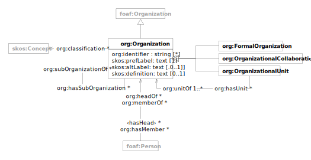

The [Organization Ontology](https://www.w3.org/TR/vocab-org/) is a W3C standard for describing organizational
structures, reporting relationships and membership. The vocabulary provides a framework for representing the structure
of organizations and their constituent parts, including formal and informal organizations, organizational units, and
relationships between people and organizations.

| prefix | namespace                            | description                                                                          |
|--------|--------------------------------------|--------------------------------------------------------------------------------------|
| org:   | http://www.w3.org/ns/org#            | [The Organization Ontology](https://www.w3.org/TR/vocab-org/)                        |
| skos:  | http://www.w3.org/2004/02/skos/core# | [Simple Knowledge Organization System (SKOS)](https://www.w3.org/TR/skos-reference/) |

# Organization

| term                                                                              | type                                           | #    | description                                                                                                   |
|-----------------------------------------------------------------------------------|------------------------------------------------|------|---------------------------------------------------------------------------------------------------------------|
| [**org:Organization**](https://www.w3.org/TR/vocab-org/#org:Organization)         | foaf:Organization                              |      | a collection of people organized together into a community or other social, commercial or political structure |
| [skos:prefLabel](https://www.w3.org/TR/skos-reference/#preflabel)                 | text                                           | 1    | preferred name of the organization                                                                            |
| [skos:altLabel](https://www.w3.org/TR/skos-reference/#altlabel)                   | text                                           | *    | alternative names of the organization                                                                         |
| [skos:definition](https://www.w3.org/TR/skos-reference/#definition)               | text                                           | 0..1 | definition of the organization                                                                                |
| [org:identifier](https://www.w3.org/TR/vocab-org/#org:identifier)                 | string                                         | 0..1 | identifier of the organization                                                                                |
| [org:classification](https://www.w3.org/TR/vocab-org/#org:classification)         | [skos:Concept](skos.md#concept)                | *    | links to classification concepts for the organization                                                         |
| [org:subOrganizationOf](https://www.w3.org/TR/vocab-org/#org:subOrganizationOf)   | [org:Organization](#organization)              | *    | links to parent organizations                                                                                 |
| [org:hasSubOrganization](https://www.w3.org/TR/vocab-org/#org:hasSubOrganization) | [org:Organization](#organization)              | *    | links to sub-organizations                                                                                    |
| [org:hasUnit](https://www.w3.org/TR/vocab-org/#org:hasUnit)                       | [org:OrganizationalUnit](#organizational-unit) | *    | links to organizational units of the organization                                                             |
| [org:hasMember](https://www.w3.org/TR/vocab-org/#org:hasMember)                   | foaf:Person                                    | *    | links to persons who are members of the organization                                                          |
| ‹hasHead› = ^[org:headOf](https://www.w3.org/TR/vocab-org/#org:headOf)            | foaf:Person                                    | *    | links to persons who lead the organization                                                                    |

> [!WARNING]
> Known deviation from standard:
>
> - `org:identifier` should be a typed literal; it is specified as string to ease interoperability with frontend
    applications

# Formal Organization

| term                                                                                    | type                              | # | description                                       |
|-----------------------------------------------------------------------------------------|-----------------------------------|---|---------------------------------------------------|
| [**org:FormalOrganization**](https://www.w3.org/TR/vocab-org/#class-formalorganization) | [org:Organization](#organization) |   | an organization recognized in legal jurisdictions |

# Organizational Collaboration

| term                                                                                                      | type                              | # | description                                       |
|-----------------------------------------------------------------------------------------------------------|-----------------------------------|---|---------------------------------------------------|
| [**org:OrganizationalCollaboration**](https://www.w3.org/TR/vocab-org/#class-organizationalcollaboration) | [org:Organization](#organization) |   | a collaboration between two or more organizations |

# Organizational Unit

| term                                                                                    | type                              | #    | description                                              |
|-----------------------------------------------------------------------------------------|-----------------------------------|------|----------------------------------------------------------|
| [**org:OrganizationalUnit**](https://www.w3.org/TR/vocab-org/#class-organizationalunit) | [org:Organization](#organization) |      | an organization that is part of some larger organization |
| [org:unitOf](https://www.w3.org/TR/vocab-org/#org:unitOf)                               | [org:Organization](#organization) | 1..* | links to organizations this unit belongs to              |
