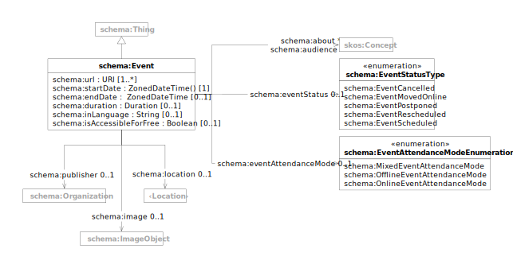

This document describes the [Schema.org](https://schema.org/docs/schemas.html) Event type and its properties used for
modeling events, meetings, conferences, and other time-based activities. These schemas enable structured representation
of event information for search engines and event applications.

| prefix  | namespace           | definition                                   |
|---------|---------------------|----------------------------------------------|
| schema: | https://schema.org/ | [Schema.org](https://schema.org/) vocabulary |

| term                                                                             | type                                          | #    | description                                       |
|----------------------------------------------------------------------------------|-----------------------------------------------|------|---------------------------------------------------|
| **[schema:Event](https://schema.org/Event)**                                     | [schema:Thing](schema.md#thing)               |      | An event happening at a certain time and location |
| [schema:name](https://schema.org/name)                                           | text                                          | 0..1 | name of the event                                 |
| [schema:disambiguatingDescription](https://schema.org/disambiguatingDescription) | text                                          | 0..1 | short disambiguating description of the event     |
| [schema:description](https://schema.org/description)                             | text                                          | 0..1 | description of the event                          |
| [schema:image](https://schema.org/image)                                         | [schema:ImageObject](schema.md#image-object)  | 0..1 | links to an image of the event                    |
| [schema:url](https://schema.org/url)                                             | URI                                           | 1..* | links to web pages describing the event           |
| [schema:startDate](https://schema.org/startDate)                                 | dateTime                                      | 1    | start date and time of the event                  |
| [schema:endDate](https://schema.org/endDate)                                     | dateTime                                      | 0..1 | end date and time of the event                    |
| [schema:duration](https://schema.org/duration)                                   | duration                                      | 0..1 | duration of the event                             |
| [schema:inLanguage](https://schema.org/inLanguage)                               | string                                        | 0..1 | language of the event                             |
| [schema:isAccessibleForFree](https://schema.org/isAccessibleForFree)             | boolean                                       | 0..1 | whether the event is accessible for free          |
| [schema:eventAttendanceMode](https://schema.org/eventAttendanceMode)             | EventAttendanceModeEnumeration                | 0..1 | attendance mode of the event                      |
| [schema:eventStatus](https://schema.org/eventStatus)                             | EventStatusType                               | 0..1 | status of the event                               |
| [schema:publisher](https://schema.org/publisher)                                 | [schema:Organization](schema.md#organization) | 0..1 | links to the organization publishing the event    |
| [schema:location](https://schema.org/location)                                   | [schema:Location](schema.md#location)         | 0..1 | links to the location of the event                |
| [schema:about](https://schema.org/about)                                         | [skos:Concept](skos.md#concept)               | *    | links to topics covered by the event              |
| [schema:audience](https://schema.org/audience)                                   | [skos:Concept](skos.md#concept)               | *    | links to the intended audience of the event       |
