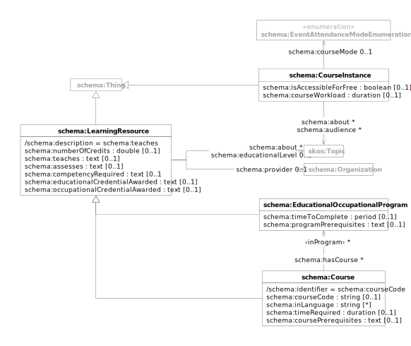

This document describes the [Schema.org](https://schema.org/docs/schemas.html) types and properties used for modeling
learning resources, including courses, programs, and educational offerings. These schemas enable structured
representation of educational content for search engines and educational applications.

| prefix  | namespace           | definition                                   |
|---------|---------------------|----------------------------------------------|
| schema: | https://schema.org/ | [Schema.org](https://schema.org/) vocabulary |

# Learning Resource

| term                                                                                     | type                                          | #    | description                                               |
|------------------------------------------------------------------------------------------|-----------------------------------------------|------|-----------------------------------------------------------|
| **[schema:LearningResource](https://schema.org/LearningResource)**                       | [schema:Thing](schema.md#thing)               |      | A creative work that provides educational value           |
| [schema:provider](https://schema.org/provider)                                           | [schema:Organization](schema.md#organization) | 0..1 | links to the organization providing the learning resource |
| [schema:teaches](https://schema.org/teaches)                                             | text                                          | 0..1 | description of what the learning resource teaches         |
| [schema:assesses](https://schema.org/assesses)                                           | text                                          | 0..1 | description of what the learning resource assesses        |
| [schema:numberOfCredits](https://schema.org/numberOfCredits)                             | decimal                                       | 0..1 | number of credits awarded for the learning resource       |
| [schema:educationalCredentialAwarded](https://schema.org/educationalCredentialAwarded)   | text                                          | 0..1 | educational credential awarded by the learning resource   |
| [schema:occupationalCredentialAwarded](https://schema.org/occupationalCredentialAwarded) | text                                          | 0..1 | occupational credential awarded by the learning resource  |
| [schema:educationalLevel](https://schema.org/educationalLevel)                           | [skos:Concept](skos.md#concept)               | 0..1 | links to the educational level of the learning resource   |
| [schema:competencyRequired](https://schema.org/competencyRequired)                       | text                                          | 0..1 | competency required for the learning resource             |
| [schema:about](https://schema.org/about)                                                 | [skos:Concept](skos.md#concept)               | *    | links to topics covered by the learning resource          |

# Educational Occupational Program

| term                                                                                           | type                                          | #    | description                                                                                      |
|------------------------------------------------------------------------------------------------|-----------------------------------------------|------|--------------------------------------------------------------------------------------------------|
| **[schema:EducationalOccupationalProgram](https://schema.org/EducationalOccupationalProgram)** | [schema:LearningResource](#learning-resource) |      | A program offered by an institution which determines the learning progress to achieve an outcome |
| [schema:timeToComplete](https://schema.org/timeToComplete)                                     | duration                                      | 0..1 | expected time to complete the program                                                            |
| [schema:programPrerequisites](https://schema.org/programPrerequisites)                         | text                                          | 0..1 | prerequisites for the program                                                                    |
| [schema:hasCourse](https://schema.org/hasCourse)                                               | [schema:Course](#course)                      | *    | links to courses that are part of the program                                                    |

# Course

| term                                                                 | type                                          | #    | description                                                                       |
|----------------------------------------------------------------------|-----------------------------------------------|------|-----------------------------------------------------------------------------------|
| **[schema:Course](https://schema.org/Course)**                       | [schema:LearningResource](#learning-resource) |      | A description of an educational course which may be offered as distinct instances |
| [schema:courseCode](https://schema.org/courseCode)                   | string                                        | 0..1 | identifier of the course                                                          |
| [schema:inLanguage](https://schema.org/inLanguage)                   | string                                        | *    | language of the course                                                            |
| [schema:timeRequired](https://schema.org/timeRequired)               | duration                                      | 0..1 | time required for the course                                                      |
| [schema:coursePrerequisites](https://schema.org/coursePrerequisites) | text                                          | 0..1 | prerequisites for the course                                                      |

# Course Instance

| term                                                                 | type                            | #    | description                                                                                                          |
|----------------------------------------------------------------------|---------------------------------|------|----------------------------------------------------------------------------------------------------------------------|
| **[schema:CourseInstance](https://schema.org/CourseInstance)**       | [schema:Thing](schema.md#thing) |      | An instance of a Course which is distinct from other instances because it is offered at a different time or location |
| [schema:isAccessibleForFree](https://schema.org/isAccessibleForFree) | boolean                         | 0..1 | whether the course instance is accessible for free                                                                   |
| [schema:courseWorkload](https://schema.org/courseWorkload)           | duration                        | 0..1 | workload of the course instance                                                                                      |
| [schema:courseMode](https://schema.org/courseMode)                   | EventAttendanceModeEnumeration  | 0..1 | attendance mode of the course instance                                                                               |
| [schema:about](https://schema.org/about)                             | [skos:Concept](skos.md#concept) | *    | links to topics covered by the course instance                                                                       |
| [schema:audience](https://schema.org/audience)                       | [skos:Concept](skos.md#concept) | *    | links to the intended audience of the course instance                                                                |

