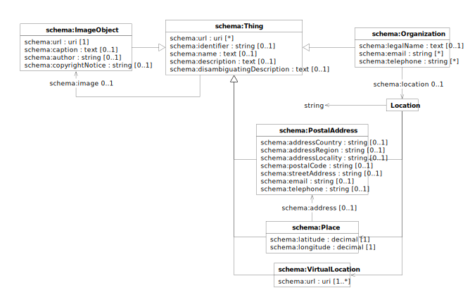

The [Schema.org](https://schema.org/docs/schemas.html) vocabulary provides a collection of schemas for structured data
markup of web pages. Schema.org defines types and properties for describing people, places, events, organizations,
products, and actions in a format understood by major search engines and other applications.

| prefix  | namespace           | definition                                   |
|---------|---------------------|----------------------------------------------|
| schema: | https://schema.org/ | [Schema.org](https://schema.org/) vocabulary |

# Thing

> [!IMPORTANT]
>
> The `schema:Thing` data model is not intended to be used in isolation but only to provide base
> definitions factoring generic properties shared by the specialised models defined by each [dataset](./index.md).

| term                                                                             | type                                | #    | description                                   |
|----------------------------------------------------------------------------------|-------------------------------------|------|-----------------------------------------------|
| **[schema:Thing](https://schema.org/Thing)**                                     |                                     |      | the most generic type of item                 |
| [schema:url](https://schema.org/url)                                             | URI                                 | *    | links to web pages describing the thing       |
| [schema:identifier](https://schema.org/identifier)                               | string                              | 0..1 | identifier of the thing                       |
| [schema:name](https://schema.org/name)                                           | text                                | 0..1 | name of the thing                             |
| [schema:description](https://schema.org/description)                             | text                                | 0..1 | description of the thing                      |
| [schema:disambiguatingDescription](https://schema.org/disambiguatingDescription) | text                                | 0..1 | short disambiguating description of the thing |
| [schema:image](https://schema.org/image)                                         | [schema:ImageObject](#image-object) | 0..1 | links to an image of the thing                |
| [schema:about](https://schema.org/about)                                         | [skos:Concept](skos.md#concept)     | *    | links to topics related to the thing          |

> [!WARNING]
> Known deviation from standard:
>
> - `schema:identifier` should be a PropertyValue or URL; it is specified as string to ease interoperability with other
    vocabularies

# Organization

| term                                                       | type                   | #    | description                                                   |
|------------------------------------------------------------|------------------------|------|---------------------------------------------------------------|
| **[schema:Organization](https://schema.org/Organization)** | [schema:Thing](#thing) |      | an organization such as a school, NGO, corporation, club, etc |
| [schema:legalName](https://schema.org/legalName)           | text                   | 0..1 | legal name of the organization                                |
| [schema:email](https://schema.org/email)                   | string                 | *    | email addresses of the organization                           |
| [schema:telephone](https://schema.org/telephone)           | string                 | *    | telephone numbers of the organization                         |
| [schema:location](https://schema.org/location)             | [Location](#location)  | 0..1 | links to the location of the organization                     |

# Location

| term              | type                                        | #    | description                                 |
|-------------------|---------------------------------------------|------|---------------------------------------------|
| ‹String›          | string                                      | 0..1 | location as a free-form textual description |
| ‹PostalAddress›   | [schema:PostalAddress](#postal-address)     | 0..1 | location as a postal address                |
| ‹Place›           | [schema:Place](#place)                      | 0..1 | location as a place                         |
| ‹VirtualLocation› | [schema:VirtualLocation](#virtual-location) | 0..1 | location as a virtual location              |

# Postal Address

| term                                                         | type                   | #    | description                            |
|--------------------------------------------------------------|------------------------|------|----------------------------------------|
| **[schema:PostalAddress](https://schema.org/PostalAddress)** | [schema:Thing](#thing) |      | the mailing address                    |
| [schema:addressCountry](https://schema.org/addressCountry)   | string                 | 0..1 | country of the postal address          |
| [schema:addressRegion](https://schema.org/addressRegion)     | string                 | 0..1 | region of the postal address           |
| [schema:addressLocality](https://schema.org/addressLocality) | string                 | 0..1 | locality of the postal address         |
| [schema:postalCode](https://schema.org/postalCode)           | string                 | 0..1 | postal code of the postal address      |
| [schema:streetAddress](https://schema.org/streetAddress)     | string                 | 0..1 | street address of the postal address   |
| [schema:email](https://schema.org/email)                     | string                 | 0..1 | email address of the postal address    |
| [schema:telephone](https://schema.org/telephone)             | string                 | 0..1 | telephone number of the postal address |

# Place

| term                                             | type                                    | #    | description                                             |
|--------------------------------------------------|-----------------------------------------|------|---------------------------------------------------------|
| **[schema:Place](https://schema.org/Place)**     | [schema:Thing](#thing)                  |      | entities that have a somewhat fixed, physical extension |
| [schema:address](https://schema.org/address)     | [schema:PostalAddress](#postal-address) | 0..1 | links to the postal address of the place                |
| [schema:latitude](https://schema.org/latitude)   | decimal                                 | 1    | WGS84 latitude of the place                             |
| [schema:longitude](https://schema.org/longitude) | decimal                                 | 1    | WGS84 longitude of the place                            |

# Virtual Location

| term                                                             | type                   | # | description                                                |
|------------------------------------------------------------------|------------------------|---|------------------------------------------------------------|
| **[schema:VirtualLocation](https://schema.org/VirtualLocation)** | [schema:Thing](#thing) |   | an online or virtual location for events and organizations |
| [schema:url](https://schema.org/url)                             | URI                    | 1 | links to the virtual location                              |

# Image Object

| term                                                         | type                   | #    | description                   |
|--------------------------------------------------------------|------------------------|------|-------------------------------|
| **[schema:ImageObject](https://schema.org/ImageObject)**     | [schema:Thing](#thing) |      | an image file                 |
| [schema:url](https://schema.org/url)                         | URI                    | 1    | links to the image file       |
| [schema:caption](https://schema.org/caption)                 | text                   | 0..1 | caption of the image          |
| [schema:author](https://schema.org/author)                   | string                 | 0..1 | author of the image           |
| [schema:copyrightNotice](https://schema.org/copyrightNotice) | string                 | 0..1 | copyright notice of the image |

> [!WARNING]
>
> The `string` type for the `schema:author` property is known deviation from the *schema.org* definition, which
> specifies
`schema:Person` or `schema:Organization` values.

> [!TIP]
>
> The `schema:description` value may be used to provide an image description suitable for accessibility support, for
> instance through the alt attribute of the `img` HTML tag.
