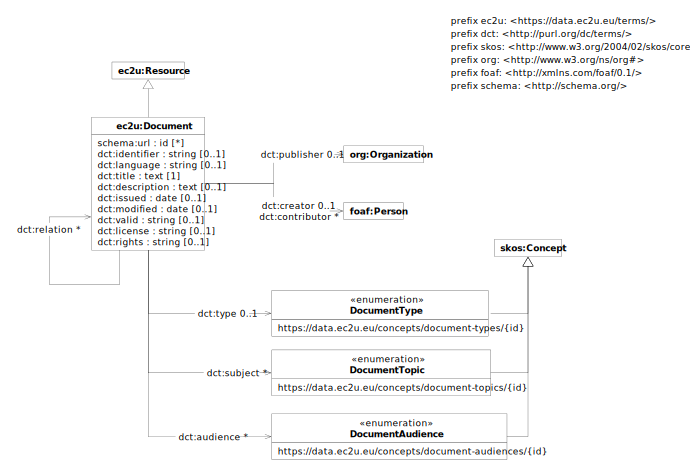

> **⚠️** **Work in progress…**

# Data Model

EC2U official documents are described using a controlled subset of
the [Dublin Core](https://www.dublincore.org/specifications/dublin-core/dcmi-terms/)
and [Organization Ontology](https://www.w3.org/TR/vocab-org/) data models, extended with:

* [SKOS](https://www.w3.org/TR/skos-primer/#seclabel) labels, as per *Organization Ontology* recommendations
* [foaf:Person](http://xmlns.com/foaf/0.1/#term_Person) and [foaf:Agent](http://xmlns.com/foaf/0.1/#term_Agent)
  properties

## ec2u:Document

| property                                                                                               | description                                                                                                                                                                                            |
|--------------------------------------------------------------------------------------------------------|--------------------------------------------------------------------------------------------------------------------------------------------------------------------------------------------------------|
| all [ec2u:Resource](resources) properties                                                              | inherited properties                                                                                                                                                                                   |
| [schema:url](http://schema.org/url)                                                                    | URLs for accessing possibly localized online versions of the document                                                                                                                                  |
| [dct:identifier](https://www.dublincore.org/specifications/dublin-core/dcmi-terms/terms/identifier/)   | a formal identifier assigned by the [publisher](#ec2upublisher)                                                                                                                                        |
| [dct:language](https://www.dublincore.org/specifications/dublin-core/dcmi-terms/terms/language/)       | the language of the document as an [RFC 5646](https://www.rfc-editor.org/info/rfc5646) language tag (e.g. `en`)                                                                                        |
| [dct:valid](https://www.dublincore.org/specifications/dublin-core/dcmi-terms/terms/valid/)             | the document validity period, in ISO 8601 format (e.g.`yyyy` for yearly validity, e.g. 2022, or `yyyy/yyyy` for multi-year validity, e.g. `2022/2025`)                                                 |
| [dct:license](https://www.dublincore.org/specifications/dublin-core/dcmi-terms/terms/license/)         | the formal document licensing terms, either as a legal licensing statement in English or a URL referring to a legal document available online (e.g. `https://creativecommons.org/licenses/by-sa/4.0/`) |
| [dct:rights](https://www.dublincore.org/specifications/dublin-core/dcmi-terms/terms/rights/)           | the formal document copyright statement (e.g. `2023 © University of Pavia. All Rights Reserved`)                                                                                                       |
| [dct:publisher](https://www.dublincore.org/specifications/dublin-core/dcmi-terms/terms/publisher/)     | a reference to the [organizational unit](#ec2u-publisher) responsible for the document                                                                                                                 |
| [dct:creator](https://www.dublincore.org/specifications/dublin-core/dcmi-terms/terms/creator/)         | a reference to the main document [author / editor / contact](#ec2uperson)                                                                                                                              |
| [dct:contributor](https://www.dublincore.org/specifications/dublin-core/dcmi-terms/terms/contributor/) | references to the other document [authors / contributors](#ec2uperson)                                                                                                                                 |
| [dct:type](https://www.dublincore.org/specifications/dublin-core/dcmi-terms/terms/type/)               | the document type; must reference one the SKOS concepts defined by the [Document Types](/concepts/document-types/) taxonomy on the *Knowledge Hub*                                                     |
| [dct:subject](https://www.dublincore.org/specifications/dublin-core/dcmi-terms/terms/subject/)         | the document subjects; must reference SKOS concepts defined by the [Document Topics](/concepts/document-topics/) taxonomy on the *Knowledge Hub*                                                       |
| [dct:audience](https://www.dublincore.org/specifications/dublin-core/dcmi-terms/terms/audience/)       | the document audiences; must reference SKOS concepts defined by the [Document Audiences](/concepts/document-audiences/) taxonomy on the *Knowledge Hub*                                                |
| [dct:relation](https://www.dublincore.org/specifications/dublin-core/dcmi-terms/terms/relation/)       | references to related documents                                                                                                                                                                        |

## ec2u:Publisher

| property                                                     | description                                             |
| ------------------------------------------------------------ | ------------------------------------------------------- |
| all [ec2u:Resource](/datasets/resources) properties          | inherited properties                                    |
| [skos:prefLabel](https://www.w3.org/TR/skos-reference/#labels) | the human-readable, localized official name of the unit |
| [foaf:homepage](http://xmlns.com/foaf/0.1/#term_homepage)    | the URL of an institutional home page                   |

## ec2u:Person

| property                                                    | description                           |
|-------------------------------------------------------------|---------------------------------------|
| all [ec2u:Resource](/datasets/resources) properties         | inherited properties                  |
| [foaf:title](http://xmlns.com/foaf/0.1/#term_title)         | the academic title (e.g. `Professor`) |
| [foaf:givenname](http://xmlns.com/foaf/0.1/#term_givenname) | the forename                          |
| [foaf:surname](http://xmlns.com/foaf/0.1/#term_surname)     | the surname                           |
| [foaf:mbox](http://xmlns.com/foaf/0.1/#term_mbox)           | an institutional email address        |

