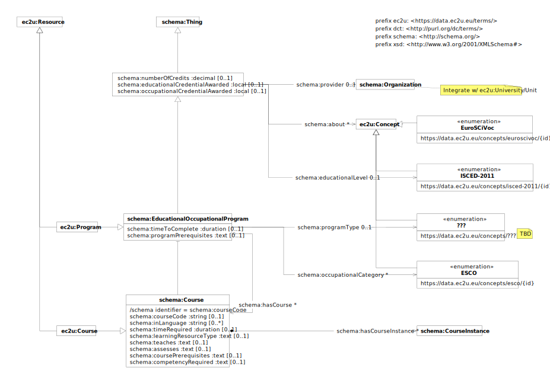

> **⚠️** **Work in progress…**

# Data Model

EC2U courses are described using a controlled subset of
the [schema:EducationalOccupationalProgram](http://schema.org/EducationalOccupationalProgram)
and  [schema:Course](http://schema.org/Course) data models.

## ec2u:Offer

An educational offer.

| property                                                                              | description                                                                                                                                                                                                                                                              |
|---------------------------------------------------------------------------------------|--------------------------------------------------------------------------------------------------------------------------------------------------------------------------------------------------------------------------------------------------------------------------|
| all [ec2u:Resource](/datasets/resources) properties                                   | inherited properties                                                                                                                                                                                                                                                     |
| all [schema:Thing](things.md) properties                                              | inherited properties                                                                                                                                                                                                                                                     |
| [schema:provider](http://schema.org/provider)                                         | link to the provider                                                                                                                                                                                                                                                     |
| [schema:educationalLevel](http://schema.org/educationalLevel)                         | link to a 1-digit [ISCED 2011](http://uis.unesco.org/en/topic/international-standard-classification-education-isced) education level in the `https://data.ec2u.eu/concepts/isced-2011/` [concept](concepts.md) scheme                                                    |
| [schema:numberOfCredits](http://schema.org/numberOfCredits)                           | number of [European Credit Transfer and Accumulation System (ECTS)](https://education.ec.europa.eu/education-levels/higher-education/inclusive-and-connected-higher-education/european-credit-transfer-and-accumulation-system) credits required to complete the program |
| [schema:educationalCredentialAwarded](http://schema.org/educationalCredentialAwarded) | human-readable, localized description of the qualification, award, certificate, diploma or other educational credential awarded as a consequence of successful completion                                                                                                |

## ec2u:Program

A program offered by an institution which determines the learning progress to achieve an outcome, usually a credential like a degree or certificate. This would define a discrete set of opportunities (e.g., courses) that together constitute a program.

| property                                                              | description                                                                                                                                                                                                      |
|-----------------------------------------------------------------------|------------------------------------------------------------------------------------------------------------------------------------------------------------------------------------------------------------------|
| all [ec2u:Offer](#ec2u-offer) properties                              | inherited properties                                                                                                                                                                                             |
| [schema:programType](http://schema.org/programType)                   | link to a [TBD] program type in the `https://data.ec2u.eu/concepts/???/` [concept](concepts.md) scheme                                                                                                           |
| [schema:occupationalCategory](http://schema.org/occupationalCategory) | link to an ESCO occupation category in the `https://data.ec2u.eu/concepts/esco/` [concept](concepts.md) scheme                                                                                                   |
| [schema:timeToComplete](http://schema.org/timeToComplete)             | the expected length of time to complete the program if attending full-time, as a [ISO 8601 duration](https://en.wikipedia.org/wiki/ISO_8601#Durations) value (e.g. `P6M` for 6 months or `PT120H` for 120 hours) |
| [schema:programPrerequisites](http://schema.org/programPrerequisites) | human-readable, localized description of enrolment requirements                                                                                                                                                  |
| [schema:hasCourse](http://schema.org/hasCourse)                       | link to the courses that are part of the program                                                                                                                                                                 |

## ec2u:Course

| property                                                              | description                                                                                                                                                                                     |
|-----------------------------------------------------------------------|-------------------------------------------------------------------------------------------------------------------------------------------------------------------------------------------------|
| all [ec2u:Offer](#ec2u-offer) properties                              | inherited properties                                                                                                                                                                            |
| [schema:courseCode](http://schema.org/courseCode)                     | course identifier assigned by the course provider                                                                                                                                               |
| [schema:inLanguage](http://schema.org/inLanguage)                     | 2-letters [IETF BCP 47](http://tools.ietf.org/html/bcp47) code of the teaching / evaluation language (e.g. `en` )                                                                               |
| [schema:learningResourceType](http://schema.org/learningResourceType) | human-readable, localized description of teaching methods and mode of study                                                                                                                     |
| [schema:timeRequired](http://schema.org/timeRequired)                 | scheduled workload in [ISO 8601 duration](https://www.w3.org/TR/xmlschema-2/#duration) format; hour‑based duration (e.g. `PT60H`) strongly suggested                                            |
| [schema:teaches](http://schema.org/teaches)                           | human-readable, localized description of target competency or learning contents                                                                                                                 |
| [schema:assesses](http://schema.org/assesses)                         | human-readable, localized description of expected competency or learning outcome                                                                                                                |
| [schema:coursePrerequisites](http://schema.org/coursePrerequisites)   | human-readable, localized description of admission requirements                                                                                                                                 |
| [schema:competencyRequired](http://schema.org/competencyRequired)     | human-readable, localized description of knowledge, skill, ability or personal attribute that must be demonstrated in order to earn related educational or occupational credentials (see below) |
