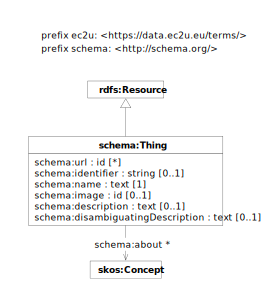

> **⚠️** **Work in progress…**

The resource data model is *abstract*, that is is not intended to be used in isolation but only to provide a base definition factoring generic properties shared by the specialized models defined by each [dataset](./index.md).

# Data Model

EC2U things are described using a controlled subset of the  [schema.org](https://schema.org) data model, with the
following major deviations:

* property types and cardinality are tightly specified and constrained

All generic human-readable labels and descriptions are localized either in English or in one of the local EC2U partner
languages.

| prefix  | namespace                   | definition                                   |
|---------|-----------------------------|----------------------------------------------|
| ec2u:   | https://data.ec2u.eu/terms/ | EC2U Knowledge Hub vocabulary                |
| schema: | https://schema.org/         | [Schema.org](https://schema.org/) vocabulary |

| property                                                                         | description                                                                                                                                                                                                                                                                                           |
|----------------------------------------------------------------------------------|-------------------------------------------------------------------------------------------------------------------------------------------------------------------------------------------------------------------------------------------------------------------------------------------------------|
| [schema:identifier](https://schema.org/identifier)                               | formal identifier assigned by the item owner                                                                                                                                                                                                                                                          |
| [schema:url](https://schema.org/url)                                             | link to the original item web page                                                                                                                                                                                                                                                                    |
| [schema:name](https://schema.org/name)                                           | title; if no language information is included, the system will assume the local language of the publishing university; missing translations in other alliance languages may be automatically provided by the system                                                                                   |
| [schema:image](https://schema.org/image)                                         | link to a related image                                                                                                                                                                                                                                                                               |
| [schema:description](https://schema.org/description)                             | extended  description; if no language information is included, the system will assume the local language of the publishing university; missing translations in other alliance languages may be automatically provided by the system                                                                   |
| [schema:disambiguatingDescription](https://schema.org/disambiguatingDescription) | short description; if no language information is included, the system will assume the local language of the publishing university; missing translations in other alliance languages may be automatically provided by the system; if missing, may be automatically extracted from `schema:description` |
| [shame:about](https://schema.org/about)                                          | a link to a topic for the entity; must reference one the SKOS [concepts](https://data.ec2u.eu/concepts/) managed by the *Knowledge Hub*                                                                                                                                                               |
